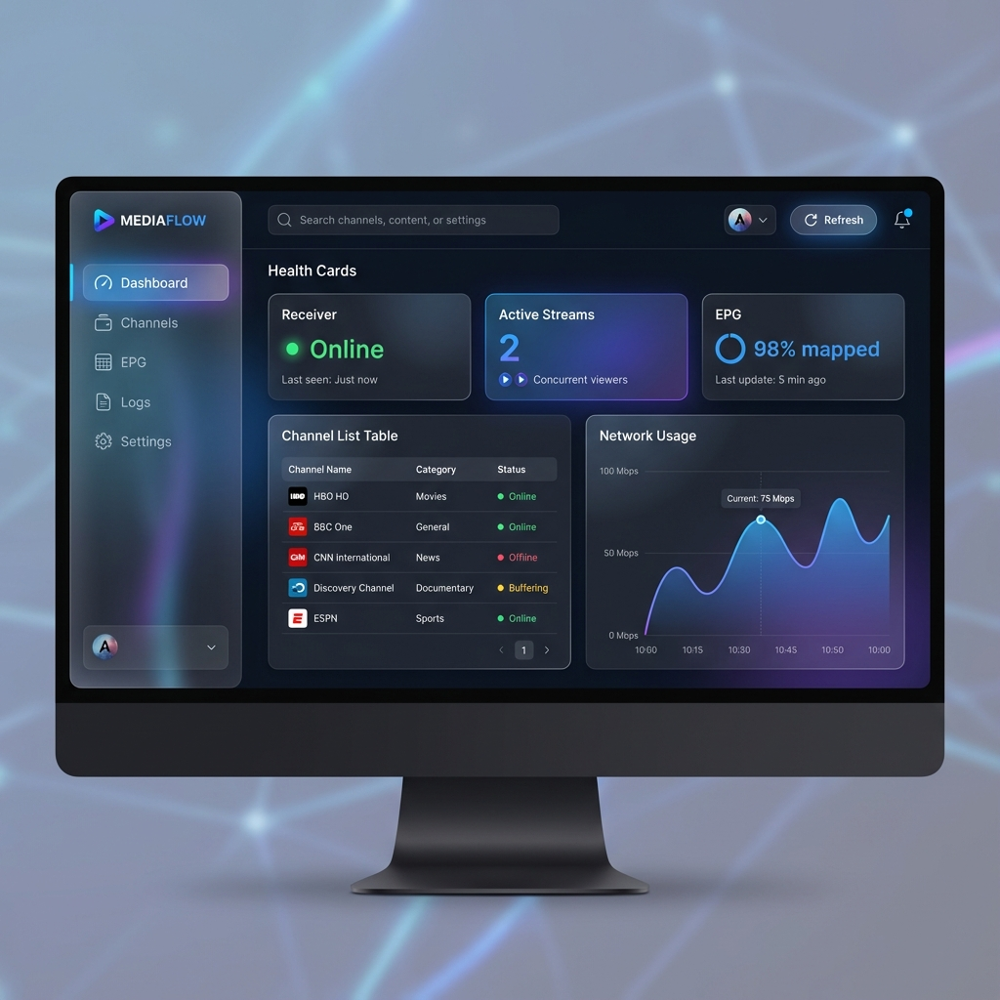

# xg2g

<div align="center">
  
  <h3>The Ultimate Gateway for Your Satellite TV</h3>
  <p>Turn your Enigma2 receiver into a modern, universal IPTV powerhouse.</p>

  [](https://github.com/ManuGH/xg2g/actions/workflows/ci.yml)
  [](https://hub.docker.com/r/manugh/xg2g)
  [](https://opensource.org/licenses/MIT)

  [Quick Start](#-quick-start) • [Features](#-features) • [WebUI](#-modern-webui) • [Docs](docs/)
</div>

---

## 🚀 Why xg2g?

**Stop struggling with M3U playlists and broken audio.**

xg2g is the missing link between your classic Enigma2 receiver (VU+, Dreambox) and the modern streaming world. It wraps your receiver in a powerful API that makes it compatible with **everything**.

| Feature | xg2g | Standard Enigma2 |
| :--- | :---: | :---: |
| **Plex / Jellyfin** | ✅ Auto-Discovery (HDHomeRun) | ❌ Manual Config Hell |
| **iPhone Audio** | ✅ Auto-Transcode (AC3→AAC) | ❌ Silent (Codec Error) |
| **Channel Switching** | ✅ Instant (< 1ms cache) | 🐢 Slow |
| **Management** | ✅ Beautiful Web Dashboard | ❌ Clunky Old WebIF |

---

## ✨ Features

### 🔌 Zero Config

Forget about editing config files. xg2g auto-detects your receiver, scans your bouquets, and configures itself. Just point it at your box and go.

### 📱 Universal Compatibility

- **Plex & Jellyfin**: Appears as a native HDHomeRun tuner. DVR, Live TV, and Guide just work.
- **iOS & Apple TV**: Real-time audio caching creates fully compliant HLS streams from satellite feeds.
- **VLC & Kodi**: Generates standard M3U playlists and XMLTV guides.

### ⚡ Rust-Powered Performance

Built with a hybrid Go/Rust architecture. The critical audio transcoding path is handled by a custom Rust remuxer that provides **1.4ms latency** with virtually zero CPU overhead.

---

## 🖥️ Modern WebUI

**New in v3.0!** Manage your streams with a sleek, dark-mode dashboard.

<div align="center">
  
</div>

- **Visual Health Checks**: Instantly see if your receiver, EPG, or streams are having issues.
- **Stream Inspector**: Monitor active transcode sessions and bandwidth usage.
- **Log Viewer**: Debug issues without digging into the command line.

---

## ⚡ Quick Start

Get up and running in **seconds** with Docker.

```bash
docker run -d \
  -p 8080:8080 \
  -p 18000:18000 \
  -e XG2G_OWI_BASE=http://192.168.1.100 \  # Your Receiver IP
  -e XG2G_BOUQUET=Favourites \             # Your Channel List
  ghcr.io/manugh/xg2g:latest
```

**That's it.**

- **WebUI**: `http://localhost:8080/ui/`
- **Playlist**: `http://localhost:8080/files/playlist.m3u`

---

## 🛠️ Advanced Usage

### Hardware Acceleration

Got an Intel QuickSync or NVIDIA GPU? xg2g can offload video transcoding to hardware, letting you stream HD content over slow mobile connections.

### Kubernetes Ready

Production-grade from day one. Includes specific endpoints for liveness/readiness probes, Prometheus metrics, and OpenTelemetry tracing.

[Read the Architecture Guide →](docs/ARCHITECTURE.md)

---

## 🤝 Join the Community

We are building the best open-source TV gateway.

- **[Discussions](https://github.com/ManuGH/xg2g/discussions)**: Ask questions and share setups.
- **[Issues](https://github.com/ManuGH/xg2g/issues)**: Report bugs or request features.

---

<div align="center">
  <sub>MIT License • Built with ❤️ by the Open Source Community</sub>
</div>
