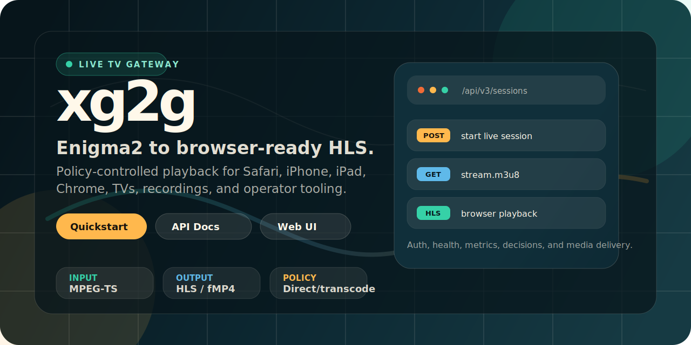

<!-- GENERATED FILE - DO NOT EDIT. Source: backend/templates/README.md.tmpl -->
# xg2g - Next Gen to Go

[](https://github.com/ManuGH/xg2g/actions/workflows/ci.yml)
[](https://github.com/ManuGH/xg2g/actions/workflows/coverage.yml)
[](https://github.com/ManuGH/xg2g/releases)
[](https://goreportcard.com/report/github.com/ManuGH/xg2g)
[](LICENSE)

<p align="center">
  
</p>

Turn Enigma2 live TV into browser-ready playback that actually works on
Safari, iPhone, iPad, Chrome, and modern TVs.

xg2g takes MPEG-TS from Enigma2 satellite and DVB-T2 receivers and delivers
native HLS with `.ts` segments to Apple devices, falling back to browser-safe
fMP4 HLS delivery when compatibility repair is needed. Observability,
fail-closed auth, and operator-friendly health checks are built in.

**Start here:** [Quickstart](#quickstart) •
[Live API Docs](https://manugh.github.io/xg2g/) •
[Configuration](docs/guides/CONFIGURATION.md) •
[Architecture](docs/arch/ARCHITECTURE.md) •
[Releases](https://github.com/ManuGH/xg2g/releases) •
[Discussions](https://github.com/ManuGH/xg2g/discussions)

## Why xg2g

| Without xg2g | With xg2g |
| :--- | :--- |
| Enigma2 raw MPEG-TS streams | Browser-ready HLS (native `.ts` and fMP4) |
| Every client wants a different stream profile | One server-enforced universal delivery policy |
| Recordings stuck on the set-top box | Seamless resume state across devices |
| DIY proxies hide failures until users complain | Health checks, logs, metrics, and clear startup gates |
| Ad hoc setups drift over time | Versioned images, release automation, and CI-backed changes |

## What goes in, what comes out

| Input | Delivery | Targets |
| :--- | :--- | :--- |
| Enigma2 live MPEG-TS | HLS (`.ts` or fMP4 segments) | Safari, iPhone, iPad, Chrome, desktop browsers |
| Enigma2 VOD / Recordings | HLS or DirectPlay | App instances, smart TVs |

The decision engine evaluates **H.264, HEVC, AV1, MPEG-2, VP9** (video) and
**AAC, AC3, E-AC3, MP2, MP3** (audio) at runtime. When no direct path is safe,
the `universal` policy transcodes to **H.264 + AAC**. Safari families
additionally get DirectPlay for HEVC and AC3.

[Full codec matrix with alias mappings, container carry rules, and transcode targets](docs/arch/CODEC_MATRIX.md)

## Quickstart

**Prerequisites:** Docker, `openssl`, and an Enigma2 receiver reachable on your
network

```bash
docker run -d --name xg2g --restart unless-stopped -p 8088:8088 \
  -e XG2G_E2_HOST="http://192.168.1.10" \
  -e XG2G_API_TOKEN="$(openssl rand -hex 32)" \
  -e XG2G_API_TOKEN_SCOPES="v3:admin" \
  -e XG2G_DECISION_SECRET="$(openssl rand -hex 32)" \
  ghcr.io/manugh/xg2g:v3.4.6
```

Check the service health:

```bash
curl -fsS http://localhost:8088/readyz
```

Then open [http://localhost:8088/ui/](http://localhost:8088/ui/)

> `XG2G_DECISION_SECRET` is mandatory. xg2g refuses to start without a live
> playback signing secret.
>
> Local quickstart over `http://localhost:8088/ui/` is supported only from the
> same host. If you access xg2g from another browser or device, you must expose
> it via HTTPS or a trusted HTTPS proxy. Browser playback needs
> `POST /api/v3/auth/session` to mint the `xg2g_session` cookie, and that
> exchange is rejected over plain HTTP for non-loopback clients.

**Next steps:**
[Configuration](docs/guides/CONFIGURATION.md) •
[Deployment](docs/ops/DEPLOYMENT.md) •
[Security](docs/ops/SECURITY.md) •
[Architecture](docs/arch/ARCHITECTURE.md) •
[ADRs](docs/ADR/)

**Local development:**

```bash
make install
make dev-tools
make start
```

Optional host bootstrap: `mise install` uses [mise.toml](mise.toml) to install
the pinned Go and Node versions. Optional containerized bootstrap: reopen the
repo in [.devcontainer/devcontainer.json](.devcontainer/devcontainer.json).

Then switch to `make start-gpu`, `make start-nvidia`, or `make dev-ui` only
when you explicitly need a hardware-specific container path or frontend HMR.

## Status

| Component | Status | Guarantee |
| :--- | :--- | :--- |
| **API** | Stable (v3) | SemVer |
| **WebUI** | Stable | Thin Client |
| **Streaming** | Production | Universal Policy |
| **FFmpeg** | Pinned (8.1) | Bundled in Docker image |

Structured logs, Prometheus metrics, OpenTelemetry traces, fail-closed auth,
Docker health checks, and CI-backed release automation are built in.

## Documentation

| | |
| :--- | :--- |
| **Get started** | [10-Minute Intro](backend/NEW_HERE.md) · [Architecture](docs/arch/ARCHITECTURE.md) · [Codec Matrix](docs/arch/CODEC_MATRIX.md) · [API Reference](https://manugh.github.io/xg2g/) · [ADRs](docs/ADR/) |
| **Operate** | [Configuration](docs/guides/CONFIGURATION.md) · [Deployment](docs/ops/DEPLOYMENT.md) · [Observability](docs/ops/OBSERVABILITY.md) · [Security](docs/ops/SECURITY.md) · [FFmpeg Build](docs/ops/FFMPEG_BUILD.md) |
| **Develop** | [Dev Guide](docs/guides/DEVELOPMENT.md) · [Setup](docs/dev/SETUP.md) · [Contributing](CONTRIBUTING.md) · [CI Playbook](docs/ops/CI_FAILURE_PLAYBOOK.md) |

## License

[PolyForm Noncommercial 1.0.0](LICENSE)

- ✅ Free for personal, homelab, and educational use
- ❌ Commercial use requires permission
