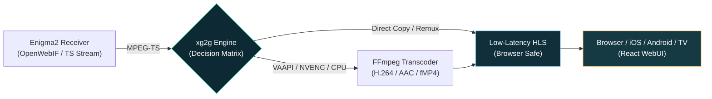

<!-- GENERATED FILE - DO NOT EDIT. Source: backend/templates/README.md.tmpl -->
# xg2g — a self-hosted streaming gateway for Enigma2

<div align="center">

[](https://github.com/ManuGH/xg2g/actions/workflows/ci.yml)
[](https://github.com/ManuGH/xg2g/actions/workflows/coverage.yml)
[](https://github.com/ManuGH/xg2g/releases)
[](backend/go.mod)
[](infra/docker/Dockerfile.release)
[](LICENSE)

<br />

<p align="center">
  
</p>

### Live TV, adaptive streaming, DVR and household access — delivered to browsers and native clients.

Converts Enigma2 transport streams into browser-ready HLS/fMP4, with hardware-accelerated transcoding, adaptive bitrate streaming, recording and centralized policy enforcement.

[**Getting Started**](docs/guides/GETTING_STARTED.md) · [**Linux Setup**](docs/guides/INSTALLATION.md) · [**Quickstart**](#quickstart) · [**Documentation**](docs/README.md) · [**Codec Matrix**](docs/arch/CODEC_MATRIX.md) · [**Releases**](https://github.com/ManuGH/xg2g/releases)

</div>

---

## Verified Capabilities

- **Zero-App Browser Playback** — Stream live TV and receiver recordings directly in Safari, Chrome, Edge, iOS, Android, and Smart TVs.
- **Dynamic Decision Engine** — Evaluates incoming stream codecs (H.264, HEVC, MPEG-2, AC3, AAC) against client capabilities to select direct copy, container remuxing, or transcoding.
- **Hardware-Offloaded Transcoding** — GPU acceleration via Intel/AMD VAAPI and NVIDIA NVENC on compatible host systems to keep CPU utilization minimal.
- **Session Arbitration & Capacity Management** — Enforces token-scoped access, session heartbeats, lease management, and concurrency limits across clients.
- **DVR & Recording Leasing** — Integrated receiver recording access and timer management with segment leasing.
- **Household Entitlements & Access Policies** — Granular device authorization, passkey pairing, and token scope enforcement.
- **Production Infrastructure** — Native systemd service integration, Docker container distribution, `/readyz` health probing, and Prometheus metrics.

---

## What xg2g is NOT

> **Notice:** xg2g is **not** an IPTV provider and does **not** supply channels, subscriptions, or content. It operates exclusively on streams retrieved from your own authorized Enigma2 satellite or cable receiver.

---

## Quickstart

### 1. Docker Container (Recommended for Evaluation)

Run xg2g on a local machine using Docker:

```bash
docker run -d --name xg2g --restart unless-stopped -p 127.0.0.1:8088:8088 \
  -e XG2G_E2_HOST="http://192.168.1.10" \
  -e XG2G_API_TOKEN="$(openssl rand -hex 32)" \
  -e XG2G_API_TOKEN_SCOPES="v3:admin" \
  -e XG2G_DECISION_SECRET="$(openssl rand -hex 32)" \
  ghcr.io/manugh/xg2g:v3.10.0
```

Verify service health:

```bash
curl -fsS http://localhost:8088/readyz
```

Access the WebUI in your browser at **[http://localhost:8088/ui/](http://localhost:8088/ui/)**.

> Note: `XG2G_DECISION_SECRET` is mandatory for signing playback session tokens. For network exposure, serve behind an HTTPS reverse proxy (e.g. Caddy, Nginx, Traefik).

### 2. Guided Linux Installer (Persistent Host Deployment)

For a dedicated Linux server installation:

```bash
sudo ./infra/systemd/setup-linux.sh
```

The installer configures secret generation, systemd service registration, automated backups, and optional Caddy HTTPS setup. Run `sudo xg2g-admin doctor` after installation to verify host setup.

---

## Architecture Pipeline


```mermaid
flowchart LR
    E2["Enigma2 Receiver\n(OpenWebIF / TS Stream)"] -->|"MPEG-TS"| DEC{"xg2g Engine\n(Decision Matrix)"}
    DEC -->|"Direct Copy / Remux"| HLS["Low-Latency HLS\n(Browser Safe)"]
    DEC -->|"VAAPI / NVENC / CPU"| FF["FFmpeg Transcoder\n(H.264 / AAC / fMP4)"]
    FF --> HLS
    HLS --> CLIENT["Browser / iOS / Android / TV\n(React WebUI)"]

    style DEC fill:#0D2933,stroke:#36D1A7,color:#fff
    style HLS fill:#102F3A,stroke:#5FB9E9,color:#fff
    style CLIENT fill:#163A43,stroke:#FFB84D,color:#fff
```

The decision engine dynamically probes incoming video (**H.264, HEVC, MPEG-2**) and audio (**AAC, AC3, E-AC3, MP2, MP3**) codecs to pick the optimal delivery path.

---

## Client, Codec & Hardware Compatibility

| Input Format | Browser Delivery | Android / Native TV | Typical Action | Hardware Acceleration |
| :--- | :--- | :--- | :--- | :--- |
| **H.264 + AAC** | Direct / Remux | Direct / Remux | Stream pass-through | Direct copy (low CPU) |
| **H.264 + AC3** | Video copy + Audio Transcode | Direct / Passthrough | Transcode audio to AAC for web | Video copy, CPU audio transcode |
| **MPEG-2** | Video Transcode (H.264) | Video Transcode / Native | Transcode video for browser | VAAPI / NVENC / CPU |
| **HEVC** | Client-dependent | Client-dependent | Capability-probed decision (remux where supported, otherwise transcode) | VAAPI / NVENC / CPU |
| **E-AC3** | Client-dependent | Direct / Transcode | Capability-probed decision (transcode to AAC for non-supported browsers) | CPU audio transcode |

---

## Capability & Production Status

### Status Definitions

- **Stable**: Implemented, production-wired to the daemon router, covered by automated tests, and part of the core supported runtime.
- **Active Development**: Implemented or partially implemented; APIs, behavior, or operational guarantees may evolve as features mature.
- **Experimental**: Available for evaluation; limited compatibility or incomplete operational guarantees.
- **Host-dependent / Client-dependent**: Functionality additionally depends on host GPU, drivers, kernel, FFmpeg build, or client capabilities.

### Status Matrix

| Subsystem | Status | Scope & Guarantee |
| :--- | :--- | :--- |
| **Live HLS / fMP4 Gateway** | **Stable** | Production-wired API (`/api/v3/sessions`, `/api/v3/hls/*`), verified by contract tests |
| **Session & Lease Control** | **Stable** | Heartbeat lease enforcement, concurrency limits, token authentication |
| **Hardware Offload Transcoding** | **Supported / Host-dependent** | VAAPI (Intel/AMD) and NVENC (NVIDIA) pipeline support on compatible host systems |
| **Multi-rendition ABR** | **Active Development** | Variant playlist generation and multi-quality variant streaming |
| **DVR & Recording Leasing** | **Active Development** | Recording access, segment leasing, timer conflict preview (`/api/v3/recordings/*`) |
| **Household Access Policies** | **Active Development** | Device grants, passkey pairing, household authorization middleware |
| **Capacity Auto-Demotion** | **Experimental** | Preflight demotion matrix based on host CPU/transcoder pressure |

---

## Documentation Directory

| Category | Guides & References |
| :--- | :--- |
| **Get Started** | [Documentation Overview](docs/README.md) · [Getting Started Guide](docs/guides/GETTING_STARTED.md) · [Linux Installation](docs/guides/INSTALLATION.md) |
| **Operations** | [System Overview (2026)](docs/arch/SYSTEM_OVERVIEW_2026.md) · [Configuration Guide](docs/guides/CONFIGURATION.md) · [Deployment Runbook](docs/ops/DEPLOYMENT.md) · [Security Operations](docs/ops/SECURITY.md) |
| **Architecture & Dev** | [Codec Matrix](docs/arch/CODEC_MATRIX.md) · [Repository Map](docs/dev/REPO_MAP.md) · [WebUI Contracts](docs/webui/README.md) · [ADRs](docs/ADR/) |

---

## Development & Quality Verification

```bash
make install       # Install build tools & WebUI dependencies
make dev-tools     # Verify developer toolchain
make doctor        # Run environment diagnostics
make ci-pr         # Run deterministic PR gate checks
make start         # Start local development stack
```

For hardware acceleration dev setups, use `make start RUNTIME=vaapi` or `make start RUNTIME=nvidia`. Read the [Repository Map](docs/dev/REPO_MAP.md) before submitting code.

---

## Security & Vulnerability Reporting

Security disclosures are handled through **GitHub Private Vulnerability Reporting**.

> **Important:** Do **NOT** submit security vulnerabilities through public GitHub issues or public discussions.

Please review our [Security Policy](.github/SECURITY.md) for instructions on submitting private security advisories.

---

## License

[PolyForm Noncommercial 1.0.0](LICENSE) — **Copyright (c) 2025-2026 ManuGH <https://github.com/ManuGH>. Original architecture & codebase directed by ManuGH.**

- **Personal & Non-Commercial Use:** Free for personal, homelab, and educational use.
- **Commercial Restriction:** Any commercial exploitation, selling, or paid hosting is strictly prohibited.
- **Trademark & Re-Branding Prohibition:** Re-branding, white-labeling, or distributing derivative works under another name or trademark without express written permission from Manuel is strictly prohibited.
