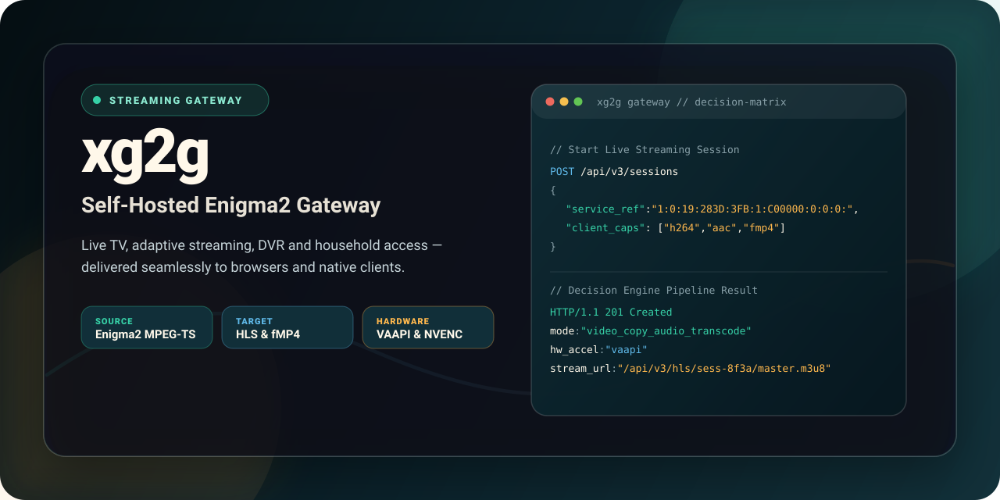
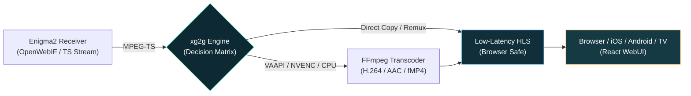

<!-- GENERATED FILE - DO NOT EDIT. Source: backend/templates/README.md.tmpl -->
# xg2g

<div align="center">

[](https://github.com/ManuGH/xg2g/actions/workflows/ci.yml)
[](https://github.com/ManuGH/xg2g/actions/workflows/coverage.yml)
[](https://github.com/ManuGH/xg2g/releases)
[](backend/go.mod)
[](docs/arch/CODEC_MATRIX.md)
[](LICENSE)

<br />

<p align="center">
  
</p>

### Watch live TV & recordings from your Enigma2 receiver in any browser — no apps required.

xg2g connects to Enigma2 receivers (VU+, Dreambox, GigaBlue) and turns raw MPEG-TS satellite/cable streams into browser-ready HLS and fMP4 on the fly.

[**Getting Started**](docs/guides/GETTING_STARTED.md) · [**Linux Setup**](docs/guides/INSTALLATION.md) · [**Quickstart**](#quickstart) · [**Documentation**](docs/README.md) · [**Codec Matrix**](docs/arch/CODEC_MATRIX.md) · [**Releases**](https://github.com/ManuGH/xg2g/releases)

</div>

---

## Features

- **Zero-App Browser Playback** — Stream live TV and DVR recordings in Safari, Chrome, Edge, iOS, Android, and Smart TVs without installing native apps.
- **Dynamic Decision Engine** — Analyzes incoming codecs (H.264, HEVC, MPEG-2, AC3, AAC) and client capabilities to pick direct playback, remuxing, or transcoding per stream.
- **Hardware Acceleration** — GPU offloading via VAAPI (Intel/AMD) and NVIDIA NVENC on x86 hosts to keep CPU usage low.
- **DVR & Recordings** — Browse and stream receiver recordings with time-shift support.
- **Production Ready** — Native systemd service, Docker container, token-scoped auth, `/readyz` health endpoints, and Prometheus metrics.

---

## Architecture Pipeline


```mermaid
flowchart LR
    E2["Enigma2 Receiver\n(OpenWebIF / TS Stream)"] -->|"MPEG-TS"| DEC{"xg2g Engine\n(Decision Matrix)"}
    DEC -->|"Direct Copy / Remux"| HLS["Low-Latency HLS\n(Browser Safe)"]
    DEC -->|"VAAPI / NVENC / CPU"| FF["FFmpeg Transcoder\n(H.264 / AAC / fMP4)"]
    FF --> HLS
    HLS --> CLIENT["Browser / iOS / Android / TV\n(React WebUI)"]

    style DEC fill:#0D2933,stroke:#36D1A7,color:#fff
    style HLS fill:#102F3A,stroke:#5FB9E9,color:#fff
    style CLIENT fill:#163A43,stroke:#FFB84D,color:#fff
```

The decision engine evaluates **H.264, HEVC, AV1, MPEG-2, VP9** video and **AAC, AC3, E-AC3, MP2, MP3** audio at runtime. Remuxing is prioritized whenever streams are browser-safe. See the [Codec & Container Matrix](docs/arch/CODEC_MATRIX.md) for details.

---

## Quickstart

### 1. Guided Linux Installer (Recommended)

For a persistent Linux server setup, download the release archive from [GitHub Releases](https://github.com/ManuGH/xg2g/releases) and run the installer:

```bash
sudo ./infra/systemd/setup-linux.sh
```

The installer handles secret generation, systemd service registration, automated backups, and an optional managed Caddy setup. Existing nginx, Traefik, Caddy, or other HTTPS proxies remain untouched. Run `sudo xg2g-admin doctor` after installation to verify the setup.

### 2. Local Docker Container

For testing xg2g on a local machine:

```bash
docker run -d --name xg2g --restart unless-stopped -p 127.0.0.1:8088:8088 \
  -e XG2G_E2_HOST="http://192.168.1.10" \
  -e XG2G_API_TOKEN="$(openssl rand -hex 32)" \
  -e XG2G_API_TOKEN_SCOPES="v3:admin" \
  -e XG2G_DECISION_SECRET="$(openssl rand -hex 32)" \
  ghcr.io/manugh/xg2g:v3.9.7
```

Check service readiness:

```bash
curl -fsS http://localhost:8088/readyz
```

Then open **[http://localhost:8088/ui/](http://localhost:8088/ui/)** in your browser.

> Note: `XG2G_DECISION_SECRET` is mandatory for signing playback sessions. If exposing xg2g across local networks or external domains, serve over HTTPS via a reverse proxy to allow session cookie minting.

---

## Documentation

| Category | Guides |
| :--- | :--- |
| **Get Started** | [Documentation Overview](docs/README.md) · [Getting Started Guide](docs/guides/GETTING_STARTED.md) · [Linux Installation](docs/guides/INSTALLATION.md) |
| **Operations** | [System Overview (2026)](docs/arch/SYSTEM_OVERVIEW_2026.md) · [Configuration Guide](docs/guides/CONFIGURATION.md) · [Deployment Runbook](docs/ops/DEPLOYMENT.md) · [Security Operations](docs/ops/SECURITY.md) |
| **Architecture & Dev** | [Codec Matrix](docs/arch/CODEC_MATRIX.md) · [Repository Map](docs/dev/REPO_MAP.md) · [WebUI Contracts](docs/webui/README.md) · [ADRs](docs/ADR/) |

---

## Development

```bash
make install       # Install build tools & dependencies
make dev-tools     # Verify toolchain
make doctor        # Run environment diagnostics
make start         # Start local development server
```

For hardware acceleration dev setups, use `make start RUNTIME=vaapi` or `make start RUNTIME=nvidia`. Read the [Repository Map](docs/dev/REPO_MAP.md) before submitting code.

---

## Status & Contracts

| Component | Status | Guarantee |
| :--- | :--- | :--- |
| **API** | Stable (`v3`) | SemVer policy ([`openapi/v3.yaml`](openapi/v3.yaml)) |
| **WebUI** | Stable | React thin client |
| **Streaming** | Production | Universal fallback (H.264 / AAC) |
| **FFmpeg Engine** | Pinned (`8.1.2`) | Hermetically bundled in release image |

---

## License

[PolyForm Noncommercial 1.0.0](LICENSE) — **Copyright (c) 2025-2026 ManuGH <https://github.com/ManuGH>. Original architecture & codebase directed by ManuGH.**

- **Personal & Non-Commercial Use:** Free for personal, homelab, and educational use.
- **Commercial Restriction:** Any commercial exploitation, selling, or paid hosting is strictly prohibited.
- **Trademark & Re-Branding Prohibition:** Re-branding, white-labeling, or distributing derivative works under another name or trademark without express written permission from Manuel is strictly prohibited.
