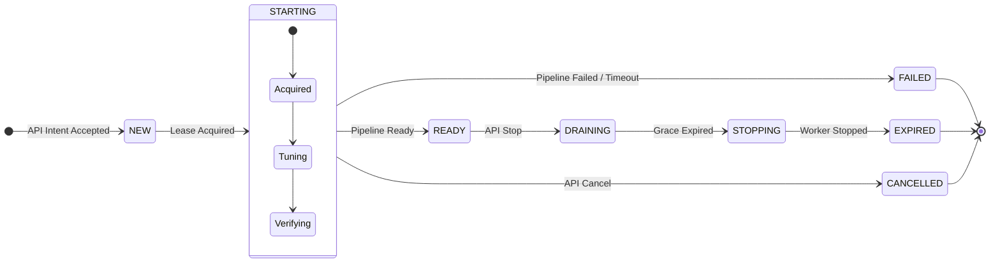
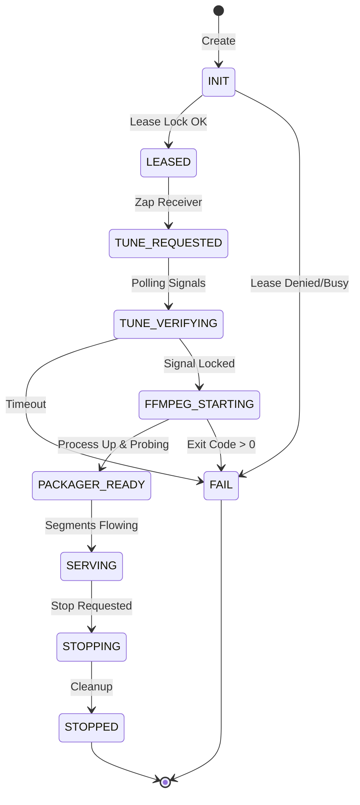
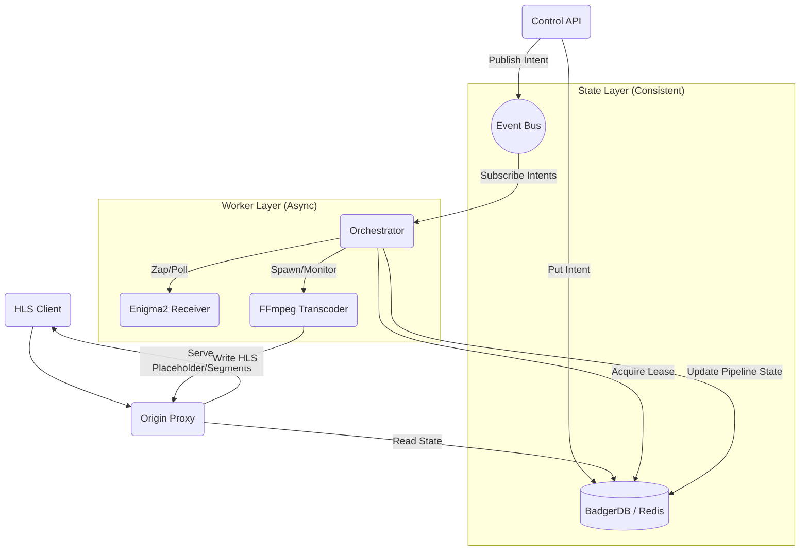

# xg2g v3.0 Architecture Vision

> [!NOTE]
> Derived from **PR #109** (v3 skeleton).
> Implements "Zero-blocking ingress", "State Store as Source of Truth", and "Async Worker" pattern.

## 1. Core Principles

1. **Synchronous Ingress Death**: API requests (Play, Stop) only interact with the `State Store` (Intent/Ticket). They *never* block on receivers.
2. **State-Driven**: Components poll or subscribe to state changes. `Preflight` becomes a simple DB lookup.
3. **Explicit Lifecycles**: Strict FSMs for Sessions (User view) and Pipelines (Worker view).

## 2. Session FSM (User/API View)

*Coarse-grained state visible to clients. Manages permissions, TTL, and logical availability.*

## 3. Pipeline FSM (Worker/Internal View)

*Fine-grained state managing the "Metal" (Enigma2, FFmpeg, DVR).*

## 4. Logical Components

## 5. Migration Strategy

1. **Skeleton Merge** (Done via PR #109 logic).
2. **Shadow Mode**: Run v3 Workers alongside v2 Proxy. v2 Proxy acts as "Client" to v3 Store.
3. **Origin Switch**: Switch `/stream/` to read from v3 Store.
4. **Deprecation**: Remove v2 synchronous paths.

## 6. Known Risks & 2026 Requirements (Critique)

*Items identified as necessary for production-grade v3, to be addressed in implementation.*

1. **FSM Granularity (Client Drift)**
    * `STARTING` is too coarse for aggressive clients (Safari/VisionOS).
    * Requirement: Sub-states (`STARTING_TUNE`, `STARTING_FFMPEG`, `STARTING_PACKAGER`) exposed to client via ReasonCode progression to prevent timeout/reload loops.

2. **Origin Placeholder Semantics**
    * Simple "Empty Playlist" can cause clients to stop playback.
    * Requirement: "Valid manifest referencing placeholder segment" OR "Master pointing to empty variant" depending on strict player testing.

3. **Lease Crash-Recovery**
    * TTL-only is insufficient for split-brain/crash recovery.
    * Requirement: Monotonic fencing tokens (Epochs) and strict Owner-ID enforcement. Bus replay must not override newer writers.

4. **Idempotency Scope**
    * Requirement: Defined scope (by `ServiceRef`+`Profile` OR arbitrary `Idempotency-Key`?). Must guarantee stable SessionID return even during partial failures.
