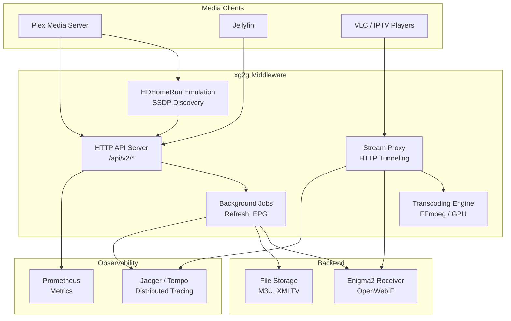
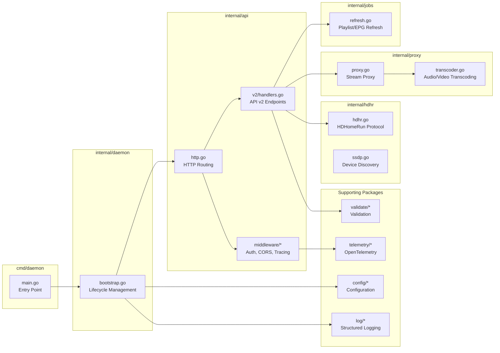
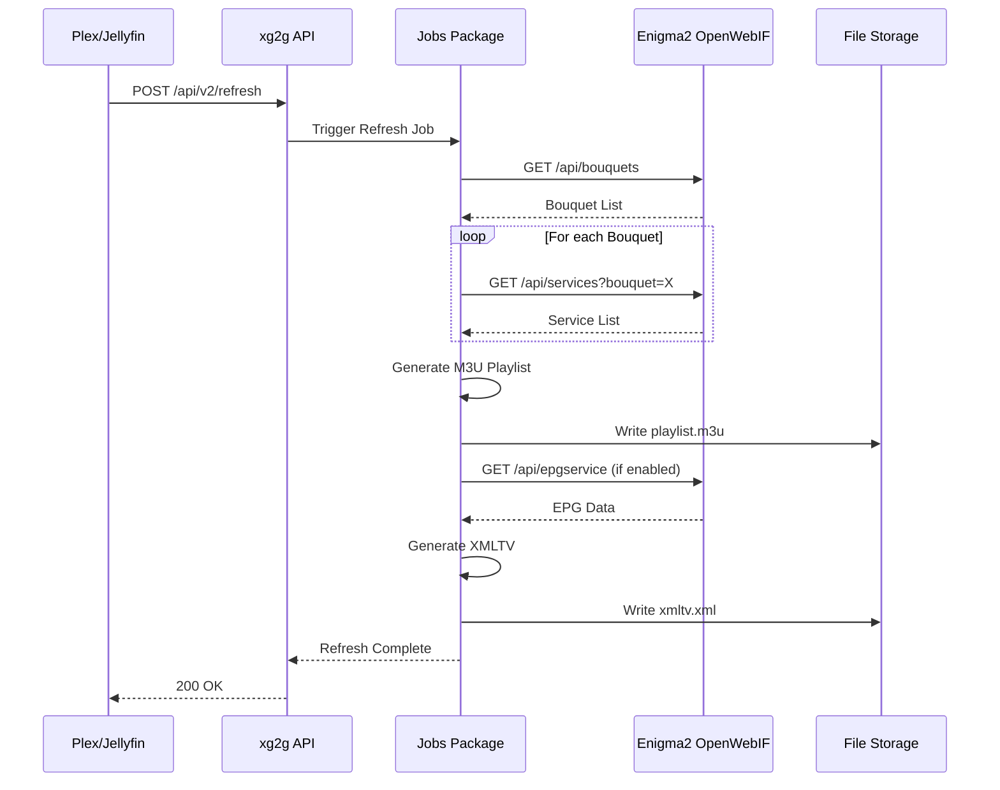
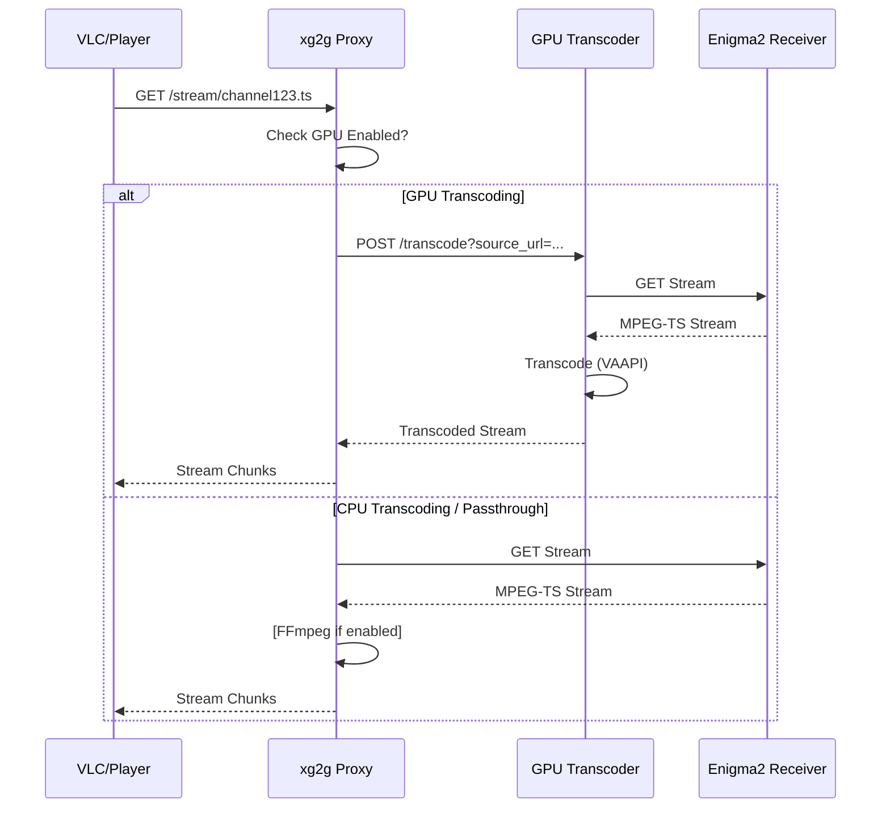

# xg2g Architecture

This document describes the high-level architecture, component interactions, and design decisions of xg2g.

## Table of Contents

- [Overview](#overview)
- [Architecture Diagram](#architecture-diagram)
- [Component Breakdown](#component-breakdown)
- [Data Flow](#data-flow)
- [Deployment Architectures](#deployment-architectures)
- [Technology Stack](#technology-stack)

## Overview

xg2g is a middleware service that bridges Enigma2 satellite/cable receivers with media servers (Plex, Jellyfin, Emby) by:

1. **Converting** Enigma2 bouquets to M3U playlists
2. **Generating** XMLTV EPG (Electronic Program Guide)
3. **Emulating** HDHomeRun for auto-discovery
4. **Proxying** live streams with optional transcoding

### Architecture Principles

- **Stateless**: No persistent state (except cached playlists/EPG)
- **Middleware Pattern**: Sits between Enigma2 and media servers
- **Plugin Architecture**: Modular transcoding, telemetry, validation
- **12-Factor App**: Configuration via ENV, horizontally scalable

## Architecture Diagram

### High-Level System Architecture



### Component Architecture



## Component Breakdown

### 1. HTTP API (`internal/api`)

**Responsibility**: Expose REST API for playlist management and status queries

**Key Endpoints**:

- `GET /api/v2/status` - Service health and version
- `POST /api/v2/refresh` - Trigger playlist/EPG refresh
- `GET /api/v2/channels` - List available channels

**Architecture Decision**: [ADR-001 API Versioning](adr/001-api-versioning.md)

### 2. Stream Proxy (`internal/proxy`)

**Responsibility**: Proxy live streams from Enigma2 to clients with optional transcoding

**Flow**:

```
Client → xg2g Proxy → Enigma2 Stream → [Transcoding?] → Client
```

**Transcoding Modes**:

- **Passthrough**: Direct proxy (no transcoding)
- **Audio Transcoding**: FFmpeg CPU-based (AAC, MP3)
- **GPU Transcoding**: External transcoder service (VAAPI, NVENC, QSV)

**Related**: [ADR-004 OpenTelemetry](adr/004-opentelemetry.md) - GPU transcoding tracing

### 3. Background Jobs (`internal/jobs`)

**Responsibility**: Periodic tasks for playlist/EPG updates

**Jobs**:

- **Playlist Refresh**: Fetch bouquets, generate M3U playlist
- **EPG Refresh**: Fetch EPG data, generate XMLTV

**Concurrency**: Configurable `EPGMaxConcurrency` for parallel channel fetching

**Related**: [ADR-003 Validation Package](adr/003-validation-package.md)

### 4. HDHomeRun Emulation (`internal/hdhr`)

**Responsibility**: Emulate HDHomeRun tuner for auto-discovery in Plex/Jellyfin

**Protocols**:

- **SSDP**: UDP multicast discovery on 239.255.255.250:1900
- **HTTP**: HDHomeRun JSON API responses

**Endpoints**:

- `GET /discover.json` - Device info
- `GET /lineup.json` - Channel lineup
- `GET /lineup_status.json` - Tuner status

### 5. Configuration (`internal/config`)

**Responsibility**: Load and validate configuration from ENV, YAML, defaults

**Precedence**: ENV > File > Defaults (highest to lowest)

**Related**: [ADR-002 Config Precedence](adr/002-config-precedence.md)

### 6. Validation (`internal/validate`)

**Responsibility**: Centralized validation with chainable API

**Validators**: URL, Port, Directory, Range, NotEmpty, OneOf, Custom

**Related**: [ADR-003 Validation Package](adr/003-validation-package.md)

### 7. Telemetry (`internal/telemetry`)

**Responsibility**: Distributed tracing with OpenTelemetry

**Instrumented Components**:

- HTTP API (all requests)
- GPU Transcoding (latency, codec, device)
- EPG Refresh Jobs (duration, channel count)

**Related**: [ADR-004 OpenTelemetry](adr/004-opentelemetry.md)

## Data Flow

### Playlist Refresh Flow



### Stream Proxy Flow (with GPU Transcoding)



## Deployment Architectures

### Single Instance (Home Lab)

```
┌─────────────┐
│   Plex      │──┐
└─────────────┘  │
                 │
┌─────────────┐  │    ┌──────────────┐      ┌──────────────┐
│  Jellyfin   │──┼───→│    xg2g      │─────→│   Enigma2    │
└─────────────┘  │    │  (Docker)    │      │   Receiver   │
                 │    └──────────────┘      └──────────────┘
┌─────────────┐  │
│   Clients   │──┘
└─────────────┘
```

### High Availability (Multi-Instance)

```
                          ┌──────────────┐
                          │   Load       │
                          │   Balancer   │
                          └───────┬──────┘
                                  │
                   ┌──────────────┼──────────────┐
                   │              │              │
              ┌────▼────┐    ┌────▼────┐    ┌───▼─────┐
              │  xg2g   │    │  xg2g   │    │  xg2g   │
              │ Instance│    │ Instance│    │ Instance│
              │    1    │    │    2    │    │    3    │
              └────┬────┘    └────┬────┘    └────┬────┘
                   │              │              │
                   └──────────────┼──────────────┘
                                  │
                          ┌───────▼──────┐
                          │   Shared     │
                          │   Storage    │
                          │  (NFS/S3)    │
                          └──────────────┘
```

### Kubernetes Deployment

```yaml
apiVersion: apps/v1
kind: Deployment
metadata:
  name: xg2g
spec:
  replicas: 3
  selector:
    matchLabels:
      app: xg2g
  template:
    metadata:
      labels:
        app: xg2g
    spec:
      containers:
      - name: xg2g
        image: xg2g:latest
        env:
        - name: XG2G_OWI_BASE
          valueFrom:
            configMapKeyRef:
              name: xg2g-config
              key: owi_base
        volumeMounts:
        - name: data
          mountPath: /data
      volumes:
      - name: data
        persistentVolumeClaim:
          claimName: xg2g-pvc
```

## Technology Stack

### Core Technologies

| Component | Technology | Why |
|-----------|------------|-----|
| **Language** | Go 1.25+ | Performance, concurrency, static typing |
| **HTTP Server** | `net/http` + `go-chi/chi` | Standard library + flexible routing |
| **Logging** | `rs/zerolog` | Fast, structured, zero-allocation |
| **Metrics** | Prometheus | Industry standard, rich ecosystem |
| **Tracing** | OpenTelemetry | Vendor-neutral, future-proof |
| **Config** | YAML + ENV | Human-readable + 12-factor compliance |
| **Transcoding** | FFmpeg / External | Proven, hardware acceleration support |

### Dependencies

**Production**:

- `github.com/go-chi/chi` - HTTP routing
- `github.com/rs/zerolog` - Structured logging
- `github.com/prometheus/client_golang` - Metrics
- `go.opentelemetry.io/otel` - Distributed tracing
- `gopkg.in/yaml.v3` - YAML parsing

**Development/Testing**:

- `github.com/stretchr/testify` - Test assertions
- `github.com/google/go-cmp` - Deep comparisons

### External Services

- **Enigma2 OpenWebIF**: Required backend
- **Jaeger/Tempo**: Optional (tracing backend)
- **Prometheus**: Optional (metrics scraping)
- **GPU Transcoder**: Optional (hardware transcoding)

## Performance Characteristics

### Throughput

- **API Requests**: ~10,000 req/s (single instance)
- **Concurrent Streams**: Limited by network bandwidth
- **EPG Refresh**: ~100 channels/sec

### Resource Usage

| Scenario | CPU | Memory | Network |
|----------|-----|--------|---------|
| Idle | <1% | ~30MB | Minimal |
| EPG Refresh | 10-20% | ~50MB | 5-10 Mbps |
| 10 Streams (passthrough) | <5% | ~60MB | 50-100 Mbps |
| GPU Transcoding | <5% | ~80MB | 100+ Mbps |

### Scalability

- **Horizontal**: Stateless design allows multiple instances
- **Vertical**: Single instance handles 100+ concurrent streams
- **Bottleneck**: Network bandwidth and Enigma2 tuner limits

## Security Architecture

### Attack Surface

1. **HTTP API**: Exposed to network
   - Mitigation: API token auth, rate limiting
2. **OpenWebIF Proxy**: Passes credentials to Enigma2
   - Mitigation: ENV vars, secrets management
3. **Stream URLs**: May expose internal IPs
   - Mitigation: `XG2G_STREAM_BASE` URL rewriting

> [!IMPORTANT]
> **Developer Note**: The `Process` method in `internal/transcoder/rust.go` encapsulates critical safety mechanisms (`runtime.LockOSThread`, buffer limits, error retrieval). **Never** bypass this method or create custom FFI wrappers without replicating these safety guarantees. Direct CGO calls without thread locking will lead to Undefined Behavior (UB) due to Rust's `thread_local` storage.

### Security Measures

- **Non-Root Containers**: User `nonroot:nonroot`
- **Read-Only Filesystem**: Prevents tampering
- **SBOM Generation**: Supply chain transparency
- **Automated Scanning**: govulncheck, Trivy, CodeQL

**Related**: [SECURITY.md](../SECURITY.md)
422:
437: 2.  **Discovery**: The server checks for VAAPI devices (`/dev/dri/renderD128`).
438: 3.  **Permissions**: The Docker container runs as user `xg2g` (65532) but is added to `video` and `render` groups to ensure access.
439: 4.  **Process**:
    - Client requests stream
    - Proxy forwards to internal GPU server (HTTP)
    - GPU server uses `ffmpeg` (via `ac-ffmpeg` crate) to transcode using VAAPI hardware acceleration
    - Stream returned to proxy -> client

## References

- [ADR-001: API Versioning](adr/001-api-versioning.md)
- [ADR-002: Config Precedence](adr/002-config-precedence.md)
- [ADR-003: Validation Package](adr/003-validation-package.md)
- [ADR-004: OpenTelemetry Integration](adr/004-opentelemetry-integration.md)
- [CI/CD Documentation](ci-cd.md)
- [Telemetry Guide](telemetry.md)

---

**Last Updated**: 2025-01-21
**Version**: 1.0
**Maintainer**: @ManuGH
