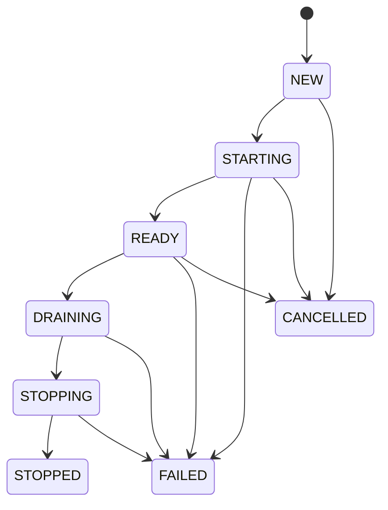
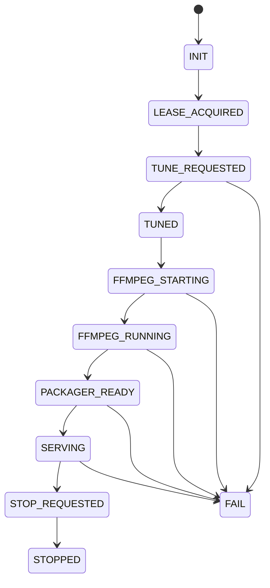

# xg2g Internals (v2.1.0)

This document is a concise map of the `internal/` tree for contributors and reviewers.
The public API includes `/api/v2/*` (stable) and `/api/v3/*` (streaming control plane).

## Entry points

- `cmd/daemon`: main runtime (config load, API, jobs, V3 worker)
- `cmd/validate`: config validation CLI
- `cmd/gencert`: TLS certificate helper

## Internal package map

| Path | Role | Notes |
| :--- | :--- | :--- |
| `internal/api` | HTTP server, routing, middleware, WebUI embed | Serves v2 (stable) and v3 APIs |
| `internal/config` | Config loader, env parsing, validation | YAML schema in `docs/guides/config.schema.json` |
| `internal/openwebif` | Enigma2 OpenWebIF client | Upstream source of channels, streams, EPG |
| `internal/jobs` | Refresh pipeline | Generates playlist + XMLTV, caches EPG |
| `internal/epg` | EPG parsing and XMLTV generation | Fuzzy matching + XMLTV output |
| `internal/playlist` / `internal/m3u` | Playlist generation and parsing | M3U output for channels |
| `internal/v3/exec` | FFmpeg + Enigma2 execution | Stream setup and transcoding (v3 only) |
| `internal/transcoder` | Rust audio transcoder bridge | AAC remux/transcode path |
| `internal/dvr` | Timers, series rules | Scheduler and series engine |
| `internal/hdhr` | HDHomeRun emulation | Plex/Jellyfin compatibility |
| `internal/health` | /healthz and /readyz | Optional strict readiness |
| `internal/resilience` | Circuit Breakers | Unified state/failure handling |
| `internal/telemetry` / `internal/metrics` | Tracing and metrics | OpenTelemetry + Prometheus |
| `internal/v3` | V3 streaming control plane | Bus + store + worker + HLS |

## Config schema summary (v2.1)

Primary schema: `docs/guides/config.schema.json`

| Section | Source | Purpose |
| :--- | :--- | :--- |
| `version` | YAML | Config schema version (v2.1.0) |
| `dataDir` | YAML/ENV | Data dir for playlists, EPG, logs |
| `openWebIF` | YAML/ENV | Receiver base URL, auth, timeouts |
| `bouquets` | YAML/ENV | Channel list selection |
| `epg` | YAML/ENV | EPG collection and XMLTV output |
| `api` | YAML/ENV | API listen addr and token |
| `metrics` | YAML/ENV | Prometheus listener |
| `picons` | YAML/ENV | Logo base URL |
| `hdhr` | YAML/ENV | HDHomeRun emulation |
| `recording_roots` | YAML/ENV | Recording storage roots |
| v3 env | ENV only | V3 worker and store config |

## Runtime flows (high level)

### Startup and refresh

1. `cmd/daemon` loads config (file + env) and validates.
2. **Pre-flight Checks**: `internal/validation` verifies permissions, paths, and dependencies.
3. **Auto-TLS**: `internal/tls` generates self-signed certificates if enabled and missing.
4. `internal/api` starts HTTP server and WebUI.
5. `internal/config` watcher starts to enable hot-reload of settings.
6. `internal/dvr` scheduler starts to manage recording rules.
7. `internal/hdhr` starts SSDP announcer for auto-discovery.
8. `internal/jobs` refresh loads bouquets and services from `internal/openwebif` (if `XG2G_INITIAL_REFRESH` is true).
9. Playlist and XMLTV are regenerated and cached on disk.

### Streaming (v3)

1. Client sends intent to `/api/v3/intents` with service reference.
2. Intent is persisted in the v3 store and published on the v3 bus.
3. v3 worker/orchestrator consumes events, acquires a tuner lease, tunes the receiver.
4. FFmpeg is spawned to transcode the stream and output HLS segments.
5. Client plays back HLS via `/api/v3/sessions/{sessionID}/hls/...`.

### WebUI

The React bundle in `webui/` is built and embedded in `internal/api/dist/*`.
`internal/api` serves it under `/ui/*` and disables caching to avoid version skew.

### v3 control plane

1. Client sends intent to `/api/v3/intents`.
2. Intent is persisted in the v3 store and published on the v3 bus.
3. v3 worker/orchestrator consumes events, acquires a tuner lease, tunes, and starts FFmpeg.
4. HLS output is written to the v3 HLS root and served via `/api/v3/sessions/...`.

## State machines (v3, simplified)

### SessionState FSM

### PipelineState FSM

Reference enums: `internal/v3/model/enums.go`.

## FFmpeg Configuration for Enigma2/DVB Receivers

**Critical Compatibility Note:** Enigma2 receivers (e.g., Vu+ boxes with OpenWebIF) require specific HTTP headers to serve streams reliably. Without these headers, FFmpeg fails with "Stream ends prematurely" errors.

### VLC-Compatible Headers

Analysis of VLC's stream handling revealed that it uses:

- **User-Agent:** `VLC/3.0.21 LibVLC/3.0.21`
- **HTTP Protocol:** HTTP/1.0 (not 1.1)
- **Custom Header:** `Icy-MetaData: 1`

These headers are implemented in `internal/v3/exec/ffmpeg/args.go:50-59` to ensure FFmpeg can reliably connect to Enigma2 receivers.

### Audio Encoding

Source streams from DVB/satellite often use AC3 5.1 surround (448 kbps). The system:

1. **Detects source channels** automatically (2.0 stereo or 5.1 surround)
2. **Transcodes to AAC** at 384 kbps (Safari-compatible, supports 5.1 natively)
3. **Preserves channel layout** using `aresample` filter to ensure proper metadata
4. **Handles dynamic changes** when broadcasts switch between stereo ads and 5.1 movies

See `internal/v3/exec/ffmpeg/args.go:67-79` for audio encoding parameters.

## Where to start reading code

- API router and wiring: `internal/api/http.go`
- Config loader and env handling: `internal/config/config.go`
- Refresh pipeline: `internal/jobs/refresh.go`
- OpenWebIF client: `internal/openwebif/client.go`
- v3 orchestrator: `internal/v3/worker/orchestrator.go`
- FFmpeg argument builder: `internal/v3/exec/ffmpeg/args.go`
- Enigma2 stream resolver: `internal/v3/exec/enigma2/client_ext.go`
