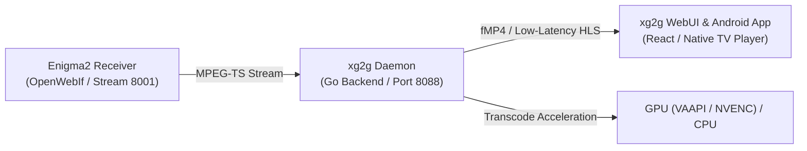

# xg2g Documentation

Start with your role. Each lane links only the docs you need; the full
directory and contributor governance are at the bottom.

For the authoritative repository, runtime, network, storage, API, WebUI, and
lifecycle snapshot as of 2026-07-28, read the
[Current 2026 System Overview](arch/SYSTEM_OVERVIEW_2026.md). Historical ADRs,
release notes, audits, and dated incident sections remain evidence of the state
at that time; they do not override the current overview or active contracts.

## ⚡ Quickstart TL;DR

```bash
# 1. Start local development environment
make dev

# 2. Deploy fast-track staging to LXC 110
./scripts/fast_deploy.sh

# 3. Run PR verification gates
make ci-pr
```

## 🏗️ Streaming Architecture Overview



## 📖 System Guides & Operation

| Task / Need | Document |
| :--- | :--- |
| Step-by-step setup | [Getting Started](guides/GETTING_STARTED.md) |
| Complete Linux server installation | [Linux Installation](guides/INSTALLATION.md) |
| Full configuration reference | [Configuration Guide](guides/CONFIGURATION.md) |
| Systemd & Docker deployment | [Deployment Guide](ops/DEPLOYMENT.md) |
| Security posture & TLS | [Security Operations](ops/SECURITY.md) |
| Codec & playback matrix | [Codec Matrix](arch/CODEC_MATRIX.md) |
| System Architecture & 2026 Overview | [2026 System Overview](arch/SYSTEM_OVERVIEW_2026.md) |
| Troubleshooting | [Troubleshooting Guide](guides/TROUBLESHOOTING.md) |

## 🔒 Internal Maintainer Reference

| Resource | Description | Document |
| :--- | :--- | :--- |
| Repository Map | Source code layout & modules | [Repo Map](dev/REPO_MAP.md) |
| Internal Architecture | System design & invariants | [Architecture Index](arch/README.md) |
| Architecture Decisions | Accepted ADR records | [ADR Index](ADR/README.md) |
| Dev Setup | Local tooling & environment | [Dev Setup](dev/SETUP.md) |
| WebUI Contracts | Frontend state & telemetry | [WebUI Index](webui/README.md) |
| Release Process | Packaging & versioning | [Release Index](release/README.md) |

## Maintenance Rules

- Keep category README files as navigation only. Put detailed behavior in the
  linked contract, runbook, or architecture document.
- Update [docs/ops/CLIENT_PROFILES.md](ops/CLIENT_PROFILES.md) when browser
  family or runtime-probe behavior changes.
- Update [docs/arch/CODEC_MATRIX.md](arch/CODEC_MATRIX.md) when codec,
  container, or transcode-target behavior changes.
- Update [docs/dev/REPO_MAP.md](dev/REPO_MAP.md) when source ownership,
  generated artifacts, or required gates change.
- The root [README.md](../README.md) is generated from
  [backend/templates/README.md.tmpl](../backend/templates/README.md.tmpl); edit
  the template as the source of truth.

## Drift Checks

Before opening a PR that changes normative docs, run the smallest relevant
verification gate plus:

```bash
git diff --check
```

If generated artifacts changed, run the matching generator/verification target
before committing.
