# xg2g Streaming Architecture

## Overview

xg2g uses a dual-pipeline architecture that separates audio transcoding (Rust) from HLS segmentation (ffmpeg). This design ensures audio is converted only once while adapting the container format only where necessary.

```mermaid
flowchart LR
    A[Satellite DVB-S - MPEG-TS AC3/MP2] --> B[🦀 Rust Transcoder libfdk-aac]
    B --> C[MPEG-TS with AAC]

    C --> D[Desktop / TV / Plex]
    C --> E[iOS Client Safari / VLC iOS]

    subgraph "HLS Pipeline (iOS only)"
        E --> F[HTTP GET /service_ref]
        F --> G[xg2g Proxy: iOS Auto-Detection]
        G --> H[ffmpeg HLS segmentation -c copy]
        H --> I[playlist.m3u8 + segment_*.ts]
        I --> J[iOS AVPlayer]
    end

    D --> K[Direct MPEG-TS Playback]
```



## Pipeline Components

### 1. Audio Transcoding (Rust - All Clients)

**Purpose**: Convert incompatible audio formats (AC3, E-AC3, MP2, MP3) to AAC-LC for universal compatibility.

**Pipeline**:
```
Satellite / Enigma2 TS (AC3/MP2)
    → Rust Transcoder (libfdk-aac)
    → MPEG-TS with AAC
```

**Technical Details**:
- **Active for**: All GET requests when transcoder is configured ([internal/proxy/proxy.go:239](../internal/proxy/proxy.go#L239))
- **Encoder**: libfdk-aac via Rust FFI
- **Output**: MPEG-TS with AAC-LC (compatible with Plex, Jellyfin, VLC, iOS)
- **Performance**: Native Rust execution with minimal latency

**Why necessary**:
- iOS cannot play AC3/MP2 audio
- Safari cannot play MPEG-TS + MP2
- Plex Web cannot play AC3 without transcoding
- Many Smart TVs prefer AAC

### 2. HLS Segmentation (ffmpeg - iOS Only)

**Purpose**: Provide HLS streaming for iOS clients that cannot reliably play raw MPEG-TS.

**Pipeline**:
```
MPEG-TS (AAC from Rust)
    → ffmpeg HLS (-c copy)
    → playlist.m3u8 + segment_00001.ts, ...
```

**Technical Details**:
- **ffmpeg command**: Uses `-c copy` ([internal/proxy/hls.go:139](../internal/proxy/hls.go#L139))
  - No re-encoding of audio or video
  - Container-only operation
- **Segment duration**: 2 seconds (low-latency live streaming)
- **Playlist size**: 6 segments (12-second buffer)
- **Cleanup**: Automatic idle stream removal after 60s ([internal/proxy/hls.go:22](../internal/proxy/hls.go#L22))

**Why necessary**:
- iOS (AVPlayer/Safari) requires HLS for reliable playback
- Safari cannot play raw MPEG-TS streams
- HLS is the iOS native streaming protocol

### 3. Client Routing (Automatic Detection)

xg2g automatically selects the appropriate output format based on User-Agent detection:

**Desktop / TV / Plex / VLC**:
```
GET /<service_ref>
  → Direct MPEG-TS stream with AAC
  → Minimal latency, no segmentation overhead
```

**iOS (Safari, VLC iOS, IPTV apps)**:
```
GET /<service_ref>
  → User-Agent detection (iPhone/iPad/AppleCoreMedia/CFNetwork)
  → Internal redirect to /hls/<service_ref>
  → HLS playlist + segments
```

**Implementation**:
- Auto-detection: [internal/proxy/proxy.go:183-210](../internal/proxy/proxy.go#L183-L210)
- HLS Manager: [internal/proxy/hls.go](../internal/proxy/hls.go)
- Segment handling: [internal/proxy/hls.go:293-311](../internal/proxy/hls.go#L293-L311)

## Data Flow Sequence


## Performance Characteristics

| Component | Operation | CPU Impact | Latency |
|-----------|-----------|------------|---------|
| Rust Transcoder | Audio AC3→AAC | Medium | ~1-3ms per chunk |
| ffmpeg HLS | Container segmentation | Low (copy-only) | ~2-6s (segment size) |
| Direct TS | Passthrough | Minimal | <100ms |

## Design Rationale

### Why Rust for Audio?

**Advantages**:
- libfdk-aac is the highest quality AAC encoder (2025)
- Native execution is fast and deterministic
- Minimal latency for live streaming
- Single transcode for all clients

**Alternatives considered**:
- ffmpeg audio transcoding: Lower quality than libfdk-aac, licensing issues
- No transcoding: iOS/Safari incompatibility

### Why ffmpeg for HLS?

**Advantages**:
- Mature HLS implementation with proper playlist management
- `-c copy` ensures no re-encoding overhead
- Handles segment rotation and cleanup automatically

**Alternatives considered**:
- Rust HLS implementation: Would require significant development for playlist/segment management
- Third-party HLS libraries: Add dependencies, uncertain iOS compatibility

### Why Separate Pipelines?

**Benefits**:
1. **Single transcode**: Audio converted once, used by both TS and HLS
2. **Minimal overhead**: ffmpeg only does container work (copy), not encoding
3. **Optimal client experience**:
   - Desktop gets raw TS (best latency)
   - iOS gets HLS (best compatibility)
4. **Resource efficiency**: No redundant transcoding

**Drawbacks avoided**:
- ❌ Transcoding for each client (CPU waste)
- ❌ Single format for all (compatibility vs. latency trade-off)
- ❌ Multiple transcode paths (code complexity)

## Code References

| Component | File | Key Functions |
|-----------|------|---------------|
| Auto iOS Detection | [internal/proxy/proxy.go](../internal/proxy/proxy.go) | Lines 183-210 (User-Agent check) |
| HLS Manager | [internal/proxy/hls.go](../internal/proxy/hls.go) | `NewHLSManager`, `ServeHLS` |
| ffmpeg Execution | [internal/proxy/hls.go](../internal/proxy/hls.go) | `Start()` (Line 128-213) |
| Segment Serving | [internal/proxy/hls.go](../internal/proxy/hls.go) | `ServeSegmentFromAnyStream` (Line 293-311) |
| Rust Transcoder | [internal/proxy/proxy.go](../internal/proxy/proxy.go) | Line 239 (transcoder path) |

## Client Compatibility Matrix

| Client Type | Format | Audio | Container | Auto-Detected |
|-------------|--------|-------|-----------|---------------|
| VLC Desktop | MPEG-TS | AAC | TS | ✅ |
| Plex Desktop | MPEG-TS | AAC | TS | ✅ |
| Safari iOS | HLS | AAC | M3U8+TS | ✅ |
| VLC iOS | HLS | AAC | M3U8+TS | ✅ |
| GSE IPTV | HLS | AAC | M3U8+TS | ✅ |
| Plex iOS | MPEG-TS | AAC | TS | ❌ (proxied) |

**Note**: Plex iOS clients are not auto-detected because Plex Server acts as proxy with User-Agent `PlexMediaServer/...`. See [HLS-STREAMING-GUIDE.md](../tmp/HLS-STREAMING-GUIDE.md) for workarounds.

## Summary

xg2g's streaming architecture achieves:

✅ **Universal audio compatibility** via Rust libfdk-aac transcoding
✅ **iOS HLS support** via ffmpeg segmentation (copy-only)
✅ **Zero re-encoding** for HLS (uses AAC from Rust)
✅ **Optimal latency** for desktop clients (direct TS)
✅ **Automatic client routing** based on User-Agent
✅ **Resource efficiency** (single transcode, minimal CPU)

The separation of concerns (audio transcoding vs. container adaptation) ensures maximum compatibility with minimal overhead.
