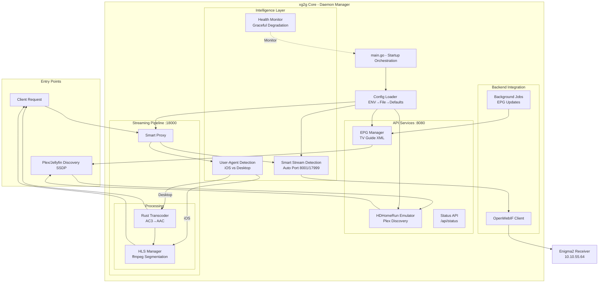
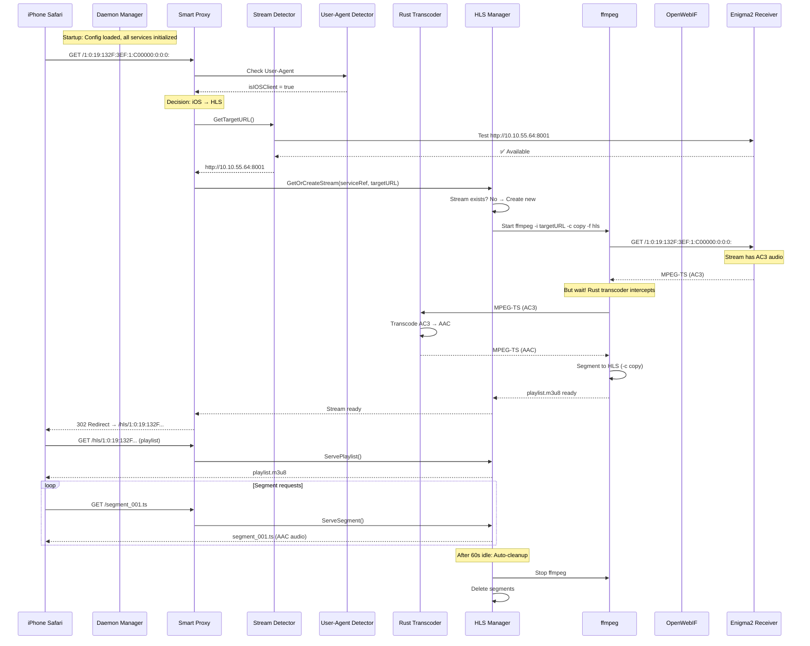

# xg2g System Intelligence

## Wie xg2g zu einem intelligenten, logischen Ganzen wird

xg2g ist kein simpler Proxy - es ist ein **adaptives Streaming-System** mit mehreren Intelligenz-Schichten, die automatisch Entscheidungen treffen.

## Architektur-Übersicht



## Die 5 Intelligenz-Schichten

### 1. Config Intelligence (Startup)

**Location**: [cmd/daemon/main.go](../cmd/daemon/main.go)

**Was passiert**:
```go
// Precedence: ENV > File > Defaults
cfg, err := loader.Load()

// Smart Detection aktivieren wenn OWI_BASE gesetzt
if receiverHost != "" && openwebif.IsEnabled() {
    streamDetector = openwebif.NewStreamDetector(receiverHost, logger)
    logger.Info().Msg("Stream proxy using Smart Detection")
}
```

**Intelligente Entscheidungen**:
- ✅ ENV-Variablen überschreiben File-Config überschreibt Defaults
- ✅ Automatische Pfad-Erkennung für XMLTV
- ✅ Smart Detection wird automatisch aktiviert wenn möglich
- ✅ Fallback-Mechanismen wenn Komponenten fehlen

**Ergebnis**: System konfiguriert sich selbst optimal basierend auf Umgebung

---

### 2. Stream Detection Intelligence

**Location**: [internal/openwebif/stream_detector.go](../internal/openwebif/stream_detector.go)

**Was passiert**:
```go
// Versuche Port 8001 (Enigma2 default)
if detector.testPort(host, 8001) {
    return fmt.Sprintf("http://%s:8001", host)
}

// Fallback: Port 17999 (externer transcoder)
if detector.testPort(host, 17999) {
    return fmt.Sprintf("http://%s:17999", host)
}

// Fallback: manuelles Target
return proxyTargetURL
```

**Intelligente Entscheidungen**:
- ✅ Automatische Port-Erkennung (kein manuelles Setup)
- ✅ Caching um wiederholte Tests zu vermeiden
- ✅ Graceful Degradation (mehrere Fallbacks)

**Ergebnis**: User muss keine Ports konfigurieren - System findet den richtigen Weg

---

### 3. Client Detection Intelligence

**Location**: [internal/proxy/proxy.go:183-210](../internal/proxy/proxy.go#L183-L210)

**Was passiert**:
```go
// Auto-detect iOS clients and serve HLS
userAgent := r.Header.Get("User-Agent")
isIOSClient := strings.Contains(userAgent, "iPhone") ||
              strings.Contains(userAgent, "iPad") ||
              strings.Contains(userAgent, "iOS") ||
              strings.Contains(userAgent, "AppleCoreMedia") ||
              strings.Contains(userAgent, "CFNetwork")

if isIOSClient {
    // Automatisch HLS serving
    s.handleHLSRequest(w, r)
    return
}

// Desktop: direktes MPEG-TS
```

**Intelligente Entscheidungen**:
- ✅ Automatische Client-Erkennung (keine URL-Änderungen)
- ✅ Format-Optimierung per Client (HLS vs. TS)
- ✅ Zero-Config für Enduser

**Ergebnis**: Jeder Client bekommt automatisch das optimale Format

---

### 4. Resource Management Intelligence

**Location**: [internal/proxy/hls.go:232-253](../internal/proxy/hls.go#L232-L253)

**Was passiert**:
```go
// Cleanup-Routine läuft alle 30s
func (m *HLSManager) cleanupIdleStreams() {
    for ref, stream := range m.streams {
        if stream.isIdle(m.idleTimeout) {  // 60s idle
            logger.Info().Msg("removing idle HLS stream")
            stream.Stop()
            delete(m.streams, ref)
        }
    }
}
```

**Intelligente Entscheidungen**:
- ✅ Automatisches Aufräumen inaktiver Streams
- ✅ ffmpeg-Prozesse werden sauber beendet
- ✅ Kein manuelles Ressourcen-Management nötig

**Ergebnis**: System verwaltet Ressourcen selbstständig, kein Memory-Leak

---

### 5. Health & Graceful Degradation

**Location**: [internal/daemon/manager.go](../internal/daemon/manager.go)

**Was passiert**:
```go
// Graceful Shutdown mit Hooks
mgr.RegisterShutdownHook("hls_manager", func(ctx context.Context) error {
    if hlsManager != nil {
        hlsManager.Shutdown()  // Stop all ffmpeg processes
    }
    return nil
})

// Health Endpoint
GET /healthz
→ Prüft ob alle Komponenten bereit sind
```

**Intelligente Entscheidungen**:
- ✅ Sauberes Herunterfahren aller Komponenten
- ✅ Health-Checks für Monitoring
- ✅ Graceful degradation bei Fehlern

**Ergebnis**: System kann sicher gestoppt/neu gestartet werden

---

## Vollständiger Request-Flow (iOS Client)



## Warum ist das System "intelligent"?

### 1. Zero-Configuration
User gibt nur an:
- `XG2G_OWI_BASE=http://10.10.55.64`
- `XG2G_ENABLE_STREAM_PROXY=true`

System entscheidet automatisch:
- ✅ Welcher Port (8001 vs 17999)
- ✅ Welches Format (HLS vs TS)
- ✅ Wann ffmpeg starten
- ✅ Wann ffmpeg stoppen
- ✅ Ob Transcoding nötig ist

### 2. Adaptive Behavior
Gleiche URL, unterschiedliches Ergebnis:
- Safari iOS → HLS
- VLC Desktop → MPEG-TS
- Plex → HDHomeRun Discovery + MPEG-TS

### 3. Self-Healing
- Stream-Port nicht erreichbar? → Fallback
- ffmpeg crashed? → Cleanup + neustart beim nächsten Request
- Idle streams? → Automatisch aufräumen

### 4. Optimized Resource Usage
- ffmpeg läuft **nur** wenn iOS-Client aktiv ist
- Rust transcode läuft **nur** wenn Audio inkompatibel
- EPG refresh läuft **nur** wenn EPG aktiviert

## Code-Verbindungen (Wie alles zusammenkommt)

### Initialisierung (main.go)

```go
// 1. Config laden
cfg, _ := loader.Load()

// 2. Smart Detection initialisieren
streamDetector := openwebif.NewStreamDetector(receiverHost, logger)

// 3. Proxy erstellen mit allen Dependencies
deps.ProxyConfig = &daemon.ProxyConfig{
    StreamDetector: streamDetector,  // ← Smart Detection
    Logger:         logger,
}

// 4. Daemon Manager orchestriert alles
mgr, _ := daemon.NewManager(serverCfg, deps)

// 5. Graceful Shutdown registrieren
mgr.RegisterShutdownHook("hls_manager", func(ctx context.Context) error {
    hlsManager.Shutdown()
    return nil
})

// 6. Starten
mgr.Start(ctx)
```

### Request Handling (proxy.go)

```go
func (s *Server) ServeHTTP(w http.ResponseWriter, r *http.Request) {
    // 1. iOS Detection
    if isIOSClient {
        s.handleHLSRequest(w, r)  // ← HLS Pipeline
        return
    }

    // 2. Smart Stream Detection
    targetURL := s.streamDetector.GetTargetURL(serviceRef)

    // 3. Rust Transcoding
    if s.transcoder != nil {
        s.transcoder.Proxy(w, r, targetURL)  // ← Audio Pipeline
        return
    }

    // 4. Fallback: direkter Proxy
    s.proxy.ServeHTTP(w, r)
}
```

### Resource Management (hls.go)

```go
// Cleanup läuft kontinuierlich im Hintergrund
func (m *HLSManager) cleanupRoutine() {
    for {
        select {
        case <-m.cleanup.C:  // Jede 30s
            m.cleanupIdleStreams()
        case <-m.stopChan:  // Bei Shutdown
            return
        }
    }
}
```

## Zusammenfassung

**xg2g ist intelligent, weil**:

1. **Selbst-Konfiguration**: Findet automatisch die richtigen Ports/URLs
2. **Client-Adaption**: Erkennt iOS vs Desktop, liefert optimales Format
3. **Ressourcen-Optimierung**: Startet/stoppt ffmpeg nur wenn nötig
4. **Fehlertoleranz**: Multiple Fallbacks, graceful degradation
5. **Self-Healing**: Cleanup von toten Streams, automatisches Recovery

**Das System ist ein Ganzes, weil**:

- Config → initialisiert alle Komponenten mit korrekten Dependencies
- Daemon Manager → orchestriert Lifecycle aller Services
- Smart Detection → verbindet Proxy mit Receiver intelligent
- User-Agent Detection → routet Requests zur richtigen Pipeline
- HLS Manager → koordiniert ffmpeg-Prozesse automatisch
- Shutdown Hooks → garantieren sauberes Herunterfahren

**Ergebnis**: Ein System das "einfach funktioniert" ohne manuelle Eingriffe.
