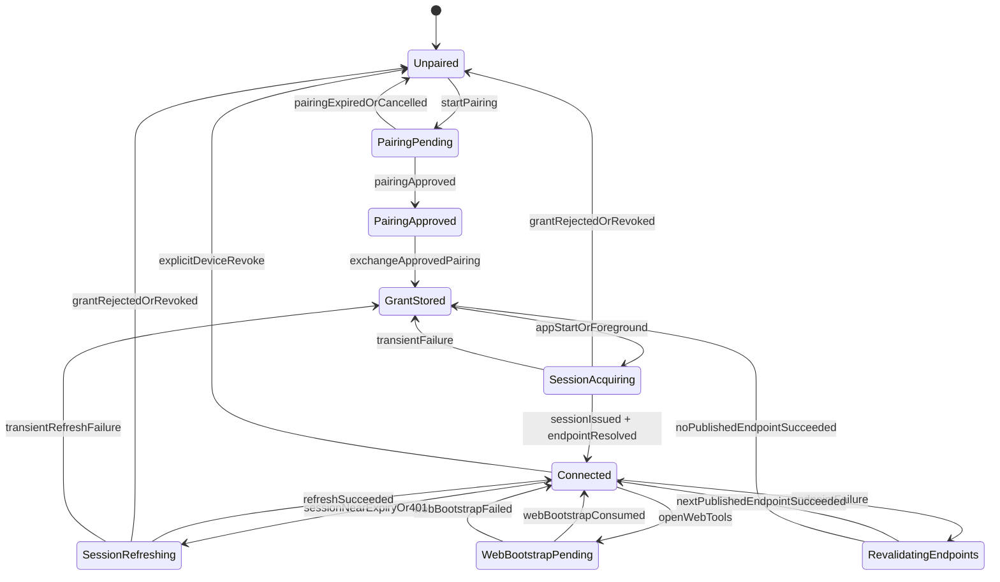

# Android Device Enrollment and Session State Machine

## Purpose

Define the normative Android runtime model for device enrollment, session
renewal, published endpoint usage, and WebView bootstrap.

This document is intentionally server-first:

- backend owns device truth
- backend owns session truth
- backend owns endpoint truth
- Android only consumes and persists the minimum required client state

## Persistent State

Stored across launches:

- `device_id`
- `device_grant`
- `device_display_name`
- `selected_server_profile`
- `last_good_endpoint_url`
- `grant_invalidated_at`

## Runtime State

Held in memory:

- `current_access_session`
- `current_session_expiry`
- `current_endpoint`
- `published_endpoints`
- `connectivity_probe_results`
- `effective_policy_snapshot`
- `web_bootstrap_url`

## State Diagram

## Transition Rules

### Unpaired

Entry conditions:

- no `device_grant`
- revoked device
- explicit sign-out with device removal

Allowed actions:

- start pairing
- render TV QR/code enrollment UI
- render phone/tablet scan/approval UI

### PairingPending

Client holds:

- `pairing_id`
- `pairing_secret`
- `user_code`
- `expires_at`

Rules:

- poll only the declared pairing status endpoint
- do not derive session state from the user code
- expiry returns to `Unpaired`

### GrantStored

Client has a persisted `device_grant` but no active short-lived session.

Rules:

- attempt session acquisition on foreground/start
- never use `device_grant` directly as a full API bearer for normal feature traffic

### SessionAcquiring

Rules:

- ask backend for a short-lived access session
- request published endpoint truth
- test only server-published endpoints in priority order
- cache only the last successful published endpoint

### Connected

Rules:

- all API usage flows through the current short-lived access session
- playback, guide, native screens, and WebView all derive from the same backend session truth
- endpoint changes must remain within the current published endpoint set

### WebBootstrapPending

Rules:

- native requests one-time bootstrap URL from backend
- WebView opens the returned same-origin URL
- backend converts bootstrap grant into HttpOnly web cookie
- native access session is never injected into JavaScript or URL query parameters

### SessionRefreshing

Rules:

- 401 or nearing expiry triggers refresh
- refresh failure due to transient network error returns to `GrantStored`
- refresh failure due to rejected/revoked grant returns to `Unpaired`

### RevalidatingEndpoints

Rules:

- only try remaining published endpoints
- no local network scans
- no port guessing
- no container-origin heuristics

## Failure Semantics

1. Access session expired
   - Try refresh from device grant.
   - Clear cached access token before retrying refresh.
   - Clear stale `xg2g_session` cookie before re-establishing the web session.

2. Device grant rejected
   - Clear access session.
   - Clear session cookie.
   - Mark device invalidated.
   - Transition to `Unpaired`.

3. Published endpoint failure
   - Test next published candidate.
   - If all fail, return to `GrantStored`.

4. Web bootstrap failure
   - Keep native session alive.
   - Report error.
   - Do not destroy device grant.

5. HTTP 401 / 403 on protected Android API calls
   - Clear the current `xg2g_session` cookie immediately.
   - Retry only through the existing refresh/bootstrap rules; do not invent a second auth path.

6. HTTP 401 / 403 / 410 from `POST /api/v3/auth/device/session`
   - Treat the device grant as no longer usable.
   - Clear grant and cookie state.
   - Force explicit re-enrollment.

7. HTTP 401 / 403 / 410 from legacy `auth_token` exchange
   - Clear transient access-session state and cookies.
   - Require a new interactive sign-in.

8. Legacy `auth_token` fallback
   - Remains a transitional compatibility path only.
   - Must emit explicit telemetry whenever used.
   - Must not become the default path once device grants are present.

## UX Guardrails

### TV

- primary enrollment is QR or code pairing
- no steady-state raw token entry
- no IP/port/manual-origin entry as the default happy path

### Phone and Tablet

- QR and deep-link pairing are primary flows
- native session is the anchor
- WebView is a derived web surface, not a parallel auth world

## Invariants

- Android must never invent new server origins.
- Android must never treat pairing as a permanent privileged mode.
- WebView must never receive the native access token in JavaScript-visible form.
- Loss of session must not imply loss of device enrollment.
- Loss of device grant must force explicit re-enrollment.

## References

- [ADR-023](/Users/manuel/StudioProjects/xg2g/docs/ADR/023-device-enrollment-session-model.md)
- [ADR-024](/Users/manuel/StudioProjects/xg2g/docs/ADR/024-published-endpoint-connectivity-truth.md)
- [Proposed Device/OpenAPI Contract](/Users/manuel/StudioProjects/xg2g/openapi/device-enrollment-connectivity.proposed.yaml)
