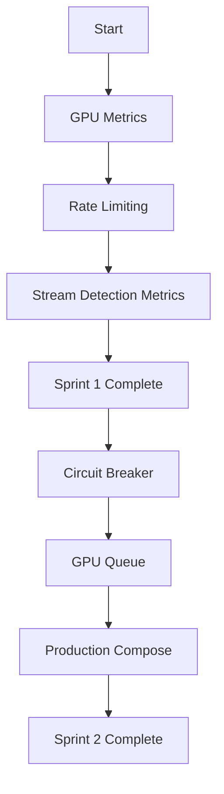

# Production Improvements for xg2g

## 📋 Overview

Diese Dokumentation enthält konkrete Implementierungspläne für Production-Ready Features basierend auf einer umfassenden Code-Review.

## 📁 Structure

```
docs/improvements/
├── README.md                      # This file (you are here)
├── EXISTING_STRENGTHS.md          # What's already excellent
├── IMPLEMENTATION_ROADMAP.md      # Complete sprint plan
│
├── TIER1_GPU_METRICS.md          # GPU observability (8h)
├── TIER1_RATE_LIMITING.md        # Rate limiting (6h)
│
├── TIER2_CIRCUIT_BREAKER.md      # Circuit breaker (4h)
├── TIER2_GPU_QUEUE.md            # GPU queue system (6h)
├── TIER2_PRODUCTION_COMPOSE.md   # Monitoring stack (4h)
│
└── TIER3_FEATURES.md             # Optional features (30h)
```

## 🎯 Quick Links

### Tier 1: Production Critical (Sprint 1-2)
- [GPU Metrics Implementation](TIER1_GPU_METRICS.md) - 8h effort
- [Rate Limiting Middleware](TIER1_RATE_LIMITING.md) - 6h effort
- Stream Detection Error Metrics - 2h effort

### Tier 2: High-Value Features (Sprint 3-4)
- [Circuit Breaker for Stream Detection](TIER2_CIRCUIT_BREAKER.md) - 4h effort
- [GPU Queue System (Multi-Client)](TIER2_GPU_QUEUE.md) - 6h effort
- [Production Docker Compose](TIER2_PRODUCTION_COMPOSE.md) - 4h effort

### Tier 3: Nice-to-Have (Optional)
- [Safari/iOS Tests, HLS, Cloudflare Tunnel](TIER3_FEATURES.md) - 30h total

### Full Roadmap
- [Complete Implementation Roadmap](IMPLEMENTATION_ROADMAP.md)
- [Existing Strengths Analysis](EXISTING_STRENGTHS.md)

## 🚀 Quick Start

### For Tier 1 Implementation:

1. **GPU Metrics:**
   ```bash
   # Create new file
   touch internal/metrics/gpu.go

   # Follow implementation guide
   cat docs/improvements/TIER1_GPU_METRICS.md
   ```

2. **Rate Limiting:**
   ```bash
   # Create rate limiter package
   mkdir internal/ratelimit
   touch internal/ratelimit/limiter.go

   # Follow implementation guide
   cat docs/improvements/TIER1_RATE_LIMITING.md
   ```

3. **Test:**
   ```bash
   go test ./internal/metrics/...
   go test ./internal/ratelimit/...
   ```

4. **Deploy:**
   ```bash
   docker compose -f docker-compose.production.yml up -d
   ```

## 📊 Expected Impact

### Performance
- **GPU Utilization:** Visible in Grafana, kept <85%
- **Transcode Latency:** P95 <50ms for 1080p
- **Rate Limiting:** <1% requests blocked

### Reliability
- **Circuit Breaker:** Prevents cascading failures
- **Queue System:** Handles 20+ concurrent GPU streams

### Observability
- **New Metrics:** 5+ GPU-specific metrics
- **Dashboards:** 2 new Grafana dashboards
- **Alerts:** Production-ready alert rules

## 🛠️ Implementation Order



## ✅ Current Status

| Feature | Status | Effort | Sprint | Doc |
|---------|--------|--------|--------|-----|
| GPU Metrics | ✅ Documented | 8h | 1 | [TIER1_GPU_METRICS.md](TIER1_GPU_METRICS.md) |
| Rate Limiting | ✅ Documented | 6h | 1 | [TIER1_RATE_LIMITING.md](TIER1_RATE_LIMITING.md) |
| Stream Detection Metrics | ✅ Documented | 2h | 1 | [TIER1_GPU_METRICS.md](TIER1_GPU_METRICS.md) |
| Circuit Breaker | ✅ Documented | 4h | 2 | [TIER2_CIRCUIT_BREAKER.md](TIER2_CIRCUIT_BREAKER.md) |
| GPU Queue | ✅ Documented | 6h | 2 | [TIER2_GPU_QUEUE.md](TIER2_GPU_QUEUE.md) |
| Production Compose | ✅ Documented | 4h | 2 | [TIER2_PRODUCTION_COMPOSE.md](TIER2_PRODUCTION_COMPOSE.md) |
| Tier 3 Features | ✅ Documented | 30h | 3+ | [TIER3_FEATURES.md](TIER3_FEATURES.md) |

## 🧪 Testing Strategy

### Unit Tests
- GPU Metrics: Prometheus registry validation
- Rate Limiter: Per-IP, Per-Mode, Global limits
- Circuit Breaker: State transitions

### Integration Tests
- Full Mode 3 pipeline with GPU transcoding
- Rate limiting with concurrent requests
- Stream detection with fallback

### Load Tests
- 50+ parallel requests
- GPU queue with 20+ streams
- Circuit breaker under load

## 📈 Success Metrics

### Before Implementation:
- ❌ No GPU visibility
- ❌ No rate limiting
- ⚠️ Stream detection errors invisible

### After Implementation:
- ✅ GPU utilization tracked in real-time
- ✅ Rate limiting prevents overload
- ✅ Stream detection errors monitored
- ✅ Circuit breaker prevents cascading failures
- ✅ GPU queue handles multi-client scenarios

## 🔗 Related Documentation

- [Main README](../../README.md)
- [Architecture Overview](../ARCHITECTURE.md)
- [Health Checks](../HEALTH_CHECKS.md)
- [Production Deployment](../../PRODUCTION_DEPLOYMENT.md)

## 💡 Implementation Notes

### GPU Metrics
- Requires GPU monitoring tools (optional):
  - Intel: `intel_gpu_top`
  - AMD: `radeontop`
  - NVIDIA: `nvidia-smi`
- Graceful degradation if tools unavailable

### Rate Limiting
- Uses `golang.org/x/time/rate`
- Configurable via ENV variables
- Per-IP cleanup prevents memory leaks

### Circuit Breaker
- Three states: Closed, Open, Half-Open
- Automatic recovery after timeout
- Metrics for state transitions

## 🚨 Breaking Changes

None! All improvements are backward compatible:
- New ENV variables are optional
- Defaults maintain existing behavior
- No API changes

## 📝 Configuration Examples

### Minimal (existing behavior):
```yaml
# No changes needed - everything works as before
```

### With GPU Monitoring:
```bash
XG2G_GPU_STATS_ENABLED=true
XG2G_GPU_STATS_INTERVAL=5s
```

### With Rate Limiting:
```bash
XG2G_RATE_LIMIT_ENABLED=true
XG2G_RATE_LIMIT_GLOBAL_RATE=100
XG2G_RATE_LIMIT_PER_IP_RATE=10
```

### Production (full stack):
```bash
# See docker-compose.production.yml
XG2G_GPU_STATS_ENABLED=true
XG2G_RATE_LIMIT_ENABLED=true
XG2G_CIRCUIT_BREAKER_THRESHOLD=5
XG2G_GPU_QUEUE_SIZE=100
```

## 🤝 Contributing

1. Pick a feature from the roadmap
2. Follow the implementation guide
3. Write tests (aim for >90% coverage)
4. Update documentation
5. Submit PR

## 📧 Questions?

- Open an issue: [GitHub Issues](https://github.com/ManuGH/xg2g/issues)
- Review the [Implementation Roadmap](IMPLEMENTATION_ROADMAP.md)
- Check existing [Documentation](../README.md)

## 📅 Timeline

- **Sprint 1 (Woche 1-2):** Tier 1 Features (16h)
- **Sprint 2 (Woche 3-4):** Tier 2 Features (14h)
- **Sprint 3+ (Optional):** Tier 3 Features (19h+)

**Total Effort (Tier 1+2):** ~30h

---

**Last Updated:** 2025-11-12
**Status:** Ready for Implementation
**Version:** 1.0
