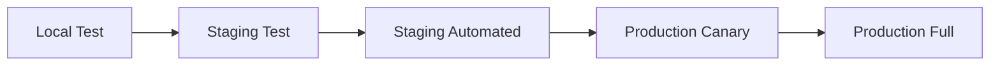

# Chaos Engineering Tests

This guide explains how to run chaos engineering tests to validate xg2g's resilience under failure conditions.

## Overview

xg2g includes three core chaos tests:

1. **Pod-Kill Test**: Validates recovery from sudden pod termination
2. **CPU-Stress Test**: Validates HPA scaling under load
3. **Upstream-Timeout Test**: Validates circuit breaker behavior

## Test Scripts

All scripts are located in [`scripts/chaos/`](../../scripts/chaos/).

### Prerequisites

#### Local Testing
```bash
# Required tools
kubectl          # Kubernetes CLI
curl             # HTTP client
jq               # JSON processor
bc               # Calculator (for threshold checks)

# Optional (for CPU stress)
stress-ng        # CPU stress tool (in container)
```

#### Kubernetes Cluster Requirements
- xg2g deployment running
- Prometheus monitoring stack (optional but recommended)
- HPA configured for xg2g deployment (for CPU-stress test)

## Running Tests

### 1. Pod-Kill Test

Simulates sudden pod failure and validates recovery time.

**Usage:**
```bash
# Basic usage
bash scripts/chaos/pod-kill.sh

# Custom configuration
NAMESPACE=production \
DEPLOYMENT=xg2g \
HEALTH_URL=http://xg2g.prod.svc.cluster.local:8080/healthz \
WAIT_TIMEOUT=120 \
bash scripts/chaos/pod-kill.sh
```

**Environment Variables:**
| Variable | Default | Description |
|----------|---------|-------------|
| `NAMESPACE` | `default` | Kubernetes namespace |
| `DEPLOYMENT` | `xg2g` | Deployment name |
| `HEALTH_URL` | `http://localhost:8080/healthz` | Health check endpoint |
| `WAIT_TIMEOUT` | `60` | Max recovery time (seconds) |
| `PROMETHEUS_URL` | `http://localhost:9090` | Prometheus endpoint |

**Expected Behavior:**
- ✅ Pod is deleted forcefully
- ✅ New pod starts within 60 seconds
- ✅ Health check passes after recovery
- ✅ Metrics show brief availability gap

**Example Output:**
```
[2025-11-12 14:30:00] Starting Pod-Kill Chaos Test
[2025-11-12 14:30:00] Namespace: default
[2025-11-12 14:30:00] Deployment: xg2g
[2025-11-12 14:30:01] Target pod: xg2g-7f8c9d6b5-abc12
[2025-11-12 14:30:01] CHAOS: Deleting pod xg2g-7f8c9d6b5-abc12...
[2025-11-12 14:30:02] Pod killed at Tue Nov 12 14:30:02 UTC 2025
[2025-11-12 14:30:15] Pod is ready (1 replicas)
[2025-11-12 14:30:15] Recovery time: 13s
[2025-11-12 14:30:20] Health check PASSED
[2025-11-12 14:30:20] Pod-Kill Test PASSED ✅
```

### 2. CPU-Stress Test

Simulates high CPU load to validate HPA scaling.

**Usage:**
```bash
# Basic usage
bash scripts/chaos/cpu-stress.sh

# Custom configuration
NAMESPACE=staging \
DEPLOYMENT=xg2g \
STRESS_DURATION=120 \
TARGET_CPU_PERCENT=90 \
bash scripts/chaos/cpu-stress.sh
```

**Environment Variables:**
| Variable | Default | Description |
|----------|---------|-------------|
| `NAMESPACE` | `default` | Kubernetes namespace |
| `DEPLOYMENT` | `xg2g` | Deployment name |
| `STRESS_DURATION` | `60` | Stress duration (seconds) |
| `TARGET_CPU_PERCENT` | `80` | Target CPU usage (%) |
| `PROMETHEUS_URL` | `http://localhost:9090` | Prometheus endpoint |

**Expected Behavior:**
- ✅ CPU usage increases to target percentage
- ✅ HPA scales up (if configured)
- ✅ P95 latency remains below 2x baseline
- ✅ System remains responsive

**Example Output:**
```
[2025-11-12 14:35:00] Starting CPU-Stress Chaos Test
[2025-11-12 14:35:01] Target pod: xg2g-7f8c9d6b5-abc12
[2025-11-12 14:35:01] CHAOS: Injecting CPU stress into xg2g-7f8c9d6b5-abc12
[2025-11-12 14:35:01]   Duration: 60s
[2025-11-12 14:35:01]   Target CPU: 80%
[2025-11-12 14:35:15] HPA scaled up to 2 replicas
[2025-11-12 14:35:30] HPA scaled up to 3 replicas
[2025-11-12 14:36:01] Stress injection completed
[2025-11-12 14:36:31] CPU-Stress Test PASSED ✅
```

### 3. Upstream-Timeout Test

Simulates slow/unresponsive upstream Enigma2 receiver.

**Usage:**
```bash
# Basic usage
bash scripts/chaos/upstream-timeout.sh

# Custom configuration
TARGET_URL=http://xg2g.prod.svc.cluster.local:8080/api/v1/lineup.json \
TIMEOUT_DURATION=60 \
DELAY_MS=10000 \
bash scripts/chaos/upstream-timeout.sh
```

**Environment Variables:**
| Variable | Default | Description |
|----------|---------|-------------|
| `TARGET_URL` | `http://localhost:8080/api/v1/lineup.json` | xg2g API endpoint |
| `TIMEOUT_DURATION` | `30` | Test duration (seconds) |
| `DELAY_MS` | `5000` | Simulated upstream delay (ms) |
| `PROMETHEUS_URL` | `http://localhost:9090` | Prometheus endpoint |

**Expected Behavior:**
- ✅ Circuit breaker opens after consecutive failures
- ✅ Requests fail fast with 503 Service Unavailable
- ✅ No cascading failures to other endpoints
- ✅ Circuit breaker closes after recovery

**Example Output:**
```
[2025-11-12 14:40:00] Starting Upstream-Timeout Chaos Test
[2025-11-12 14:40:01] CHAOS: Simulating upstream delay (5000ms for 30s)
[2025-11-12 14:40:05] ✓ Circuit breaker OPENED (protecting against failing upstream)
[2025-11-12 14:40:30] Timeout injection completed
[2025-11-12 14:40:35] ✓ Returned 503 Service Unavailable (graceful degradation)
[2025-11-12 14:41:05] ✓ Circuit breaker closed (system recovered)
[2025-11-12 14:41:05] Upstream-Timeout Test PASSED ✅
```

## Automated Testing (CI/CD)

### GitHub Actions Workflow

The [`.github/workflows/chaos-tests.yml`](../../.github/workflows/chaos-tests.yml) workflow runs chaos tests automatically:

**Schedule:**
- Nightly at 2 AM UTC (staging only)
- Manual trigger via workflow_dispatch

**Manual Trigger:**
```bash
# Via GitHub CLI
gh workflow run chaos-tests.yml \
  -f environment=staging \
  -f tests="pod-kill,cpu-stress,upstream-timeout"

# Via GitHub UI
# Actions → Chaos Engineering Tests → Run workflow
```

**Configuration:**
```yaml
inputs:
  environment:
    description: 'Target environment (staging/production)'
    required: true
    default: 'staging'
    type: choice
    options:
      - staging
      - production
  tests:
    description: 'Tests to run (comma-separated)'
    required: true
    default: 'pod-kill,cpu-stress,upstream-timeout'
```

**Artifacts:**
Each run produces:
- `chaos-test-logs.txt`: Pod logs during test
- `metrics-request-rate.txt`: Post-test request rate
- `metrics-error-rate.txt`: Post-test error rate
- `metrics-circuit-breaker.txt`: Circuit breaker state

Artifacts are retained for 30 days.

## Interpreting Results

### Success Criteria

#### Pod-Kill Test
- ✅ Recovery time < 60 seconds
- ✅ Health check passes after recovery
- ✅ No data loss (stateless service)

#### CPU-Stress Test
- ✅ HPA scales up (if configured)
- ✅ P95 latency < 2x baseline
- ✅ No pod crashes (OOMKilled)

#### Upstream-Timeout Test
- ✅ Circuit breaker activates
- ✅ Returns 503 (not 500 internal error)
- ✅ Circuit breaker recovers automatically

### Metrics to Watch

Query these in Prometheus after tests:

```promql
# Request rate recovery
rate(http_requests_total[5m])

# Error rate spike
rate(http_requests_total{status=~"5.."}[5m])

# Circuit breaker state (0=closed, 1=open)
openwebif_circuit_breaker_state

# P95 latency
histogram_quantile(0.95, rate(http_request_duration_seconds_bucket[5m]))
```

## Troubleshooting

### Pod-Kill Test Fails

**Symptom:** Pod doesn't recover within timeout

**Checks:**
1. Verify deployment has `replicas >= 1`
2. Check node resources (CPU/memory available)
3. Review pod events: `kubectl describe pod <pod-name>`
4. Check image pull policy (should be `IfNotPresent` for fast recovery)

**Fix:**
```bash
# Check deployment status
kubectl get deployment xg2g -n default -o yaml

# Check events
kubectl get events -n default --sort-by='.lastTimestamp' | tail -20

# Manually scale up if needed
kubectl scale deployment xg2g --replicas=2 -n default
```

### CPU-Stress Test: HPA Doesn't Scale

**Symptom:** HPA exists but doesn't scale up

**Checks:**
1. Verify metrics-server is running: `kubectl get deployment metrics-server -n kube-system`
2. Check HPA status: `kubectl describe hpa xg2g -n default`
3. Verify CPU requests are set in deployment
4. Check HPA thresholds (may need tuning)

**Fix:**
```yaml
# Ensure deployment has resource requests
spec:
  containers:
    - name: xg2g
      resources:
        requests:
          cpu: 500m
          memory: 256Mi
        limits:
          cpu: 2000m
          memory: 1Gi
```

```yaml
# Tune HPA thresholds
apiVersion: autoscaling/v2
kind: HorizontalPodAutoscaler
metadata:
  name: xg2g
spec:
  scaleTargetRef:
    apiVersion: apps/v1
    kind: Deployment
    name: xg2g
  minReplicas: 1
  maxReplicas: 5
  metrics:
    - type: Resource
      resource:
        name: cpu
        target:
          type: Utilization
          averageUtilization: 70  # ← Lower threshold for faster scaling
```

### Upstream-Timeout Test: Circuit Breaker Doesn't Open

**Symptom:** No circuit breaker activation despite timeouts

**Checks:**
1. Verify circuit breaker is enabled in code ([`internal/openwebif/client.go`](../../internal/openwebif/client.go))
2. Check failure threshold (default: 5 consecutive failures)
3. Review timeout configuration (default: 10s)
4. Check if upstream is actually timing out

**Fix:**
```go
// Lower circuit breaker threshold for testing
// internal/openwebif/client.go

circuitState = &circuitBreaker{
    maxFailures:    3,  // ← Lower threshold
    resetTimeout:   30 * time.Second,
    failureTimeout: 5 * time.Second,  // ← Shorter timeout
}
```

## Best Practices

### 1. Test in Staging First

❌ **Don't:**
```bash
# Running directly in production
NAMESPACE=production bash scripts/chaos/pod-kill.sh
```

✅ **Do:**
```bash
# Test in staging first
NAMESPACE=staging bash scripts/chaos/pod-kill.sh

# Review results, then proceed to production with monitoring
```

### 2. Run During Low-Traffic Periods

Schedule chaos tests during maintenance windows or off-peak hours:
```yaml
# .github/workflows/chaos-tests.yml
schedule:
  - cron: '0 2 * * *'  # 2 AM UTC (low traffic)
```

### 3. Monitor Dashboards During Tests

Keep these open during manual testing:
- Grafana: Request rate, error rate, P95 latency
- Jaeger: Distributed traces showing failure propagation
- Prometheus: Alert state

### 4. Document Findings

After each test, update:
- Incident postmortems (if failures found)
- Runbooks with recovery procedures
- HPA/resource limit tuning

### 5. Progressive Rollout



## Advanced: Custom Chaos Tests

### Template for New Tests

```bash
#!/usr/bin/env bash
# my-custom-test.sh

set -euo pipefail

log() { echo -e "\033[0;32m[$(date +'%Y-%m-%d %H:%M:%S')]\033[0m $*"; }
error() { echo -e "\033[0;31m[$(date +'%Y-%m-%d %H:%M:%S')] ERROR:\033[0m $*"; }

run_test() {
    log "Starting Custom Chaos Test"

    # Phase 1: Baseline
    collect_baseline_metrics

    # Phase 2: Inject chaos
    inject_chaos

    # Phase 3: Observe
    monitor_system

    # Phase 4: Validate recovery
    wait_for_recovery

    # Phase 5: Verdict
    evaluate_results
}

run_test
```

### Example: Network Partition Test

```bash
# Simulate network partition using Toxiproxy
kubectl run toxiproxy --image=ghcr.io/shopify/toxiproxy:latest
kubectl exec toxiproxy -- /toxiproxy-cli create xg2g-upstream -l 0.0.0.0:8474 -u receiver.local:80
kubectl exec toxiproxy -- /toxiproxy-cli toxic add xg2g-upstream -t timeout -a timeout=5000

# Run test
sleep 60

# Clean up
kubectl exec toxiproxy -- /toxiproxy-cli delete xg2g-upstream
```

## References

- [Circuit Breaker Implementation](../../internal/openwebif/client.go)
- [Rate Limiting Middleware](../../internal/api/middleware.go)
- [Prometheus Metrics](../guides/monitoring.md)
- [Chaos Engineering Principles](https://principlesofchaos.org/)
- [Kubernetes Pod Lifecycle](https://kubernetes.io/docs/concepts/workloads/pods/pod-lifecycle/)

## Related Documentation

- [Deployment Guide](deployment-guide.md)
- [Monitoring Setup](monitoring.md)
- [Incident Response](../operations/incident-response.md)
