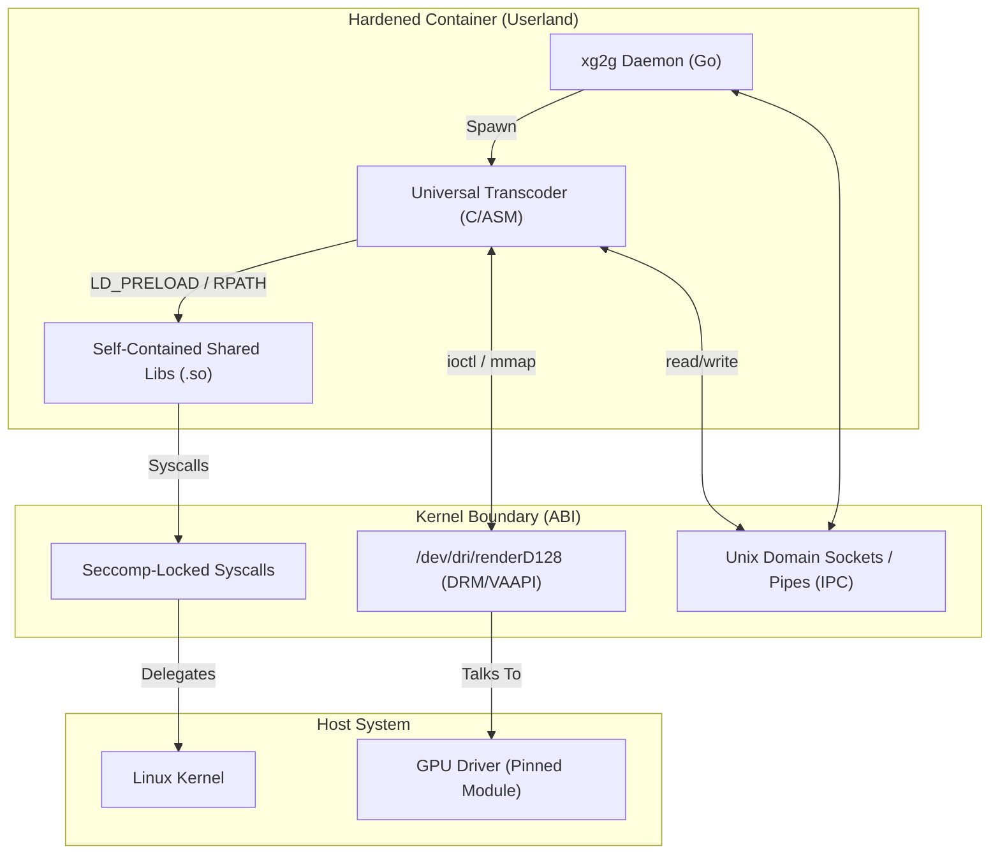

# Design: Hermetic Execution Boundary (ABI-Level)

## 1. Objective

To achieve "Hermetic Execution Truth" by strictly defining and controlling the Application Binary Interface (ABI) boundary between the `xg2g` daemon and the host system, specifically for hardware-accelerated transcoding.

## 2. The ABI Boundary

The boundary is defined as the set of syscalls and resources that the `xg2g` process (or its transcoding children) interacts with.

## 3. Boundary Definitions

### What MUST Cross the Boundary (Permitted)

- **File Descriptors**: Only fds for pipes (stdin/stdout) and unix sockets for IPC synchronization.
- **DRM Render Nodes**: `/dev/dri/renderD128` (or similar) requested via explicit VAAPI context.
- **IPC Synchronicity**: Signal handling (SIGTERM/SIGKILL) for lifecycle management.
- **Mapped Memory**: Only for DMA-BUF sharing between transcoder and GPU driver (as allowed by kernel).

### What is FORBIDDEN to Cross (Prohibited)

- **Ambient GLIBC**: The transcoder MUST NOT search for or link against the host's `/lib64/libc.so.6`.
- **Symbolic Resolution**: Any successful transcoder execution MUST be verifiable as not having resolved symbols outside `/opt/xg2g/lib` (mechanically enforceable).
- **Dynamic Config Paths**: No access to host `/etc` or `/var` (except the OCI-mounted data dir).
- **Network Sockets**: Transcoding processes must have zero network capability (Netlink/INET forbidden).
- **Global PIDs**: Transcoder should not see host process table (PID Namespace).

## 4. Implementation Strategy (Phase 5.1 Preview)

- **Hermetic RPATH**: All shared objects (`.so`) required for transcoding must be located in `/opt/xg2g/lib` and enforced via `RPATH` and `RUNPATH` at build time.
- **Cold-Start Validation**: On startup, `xg2g` will attempt a "No-Host" execution test of the transcoder to verify all symbols resolve within the container's internal library path.
